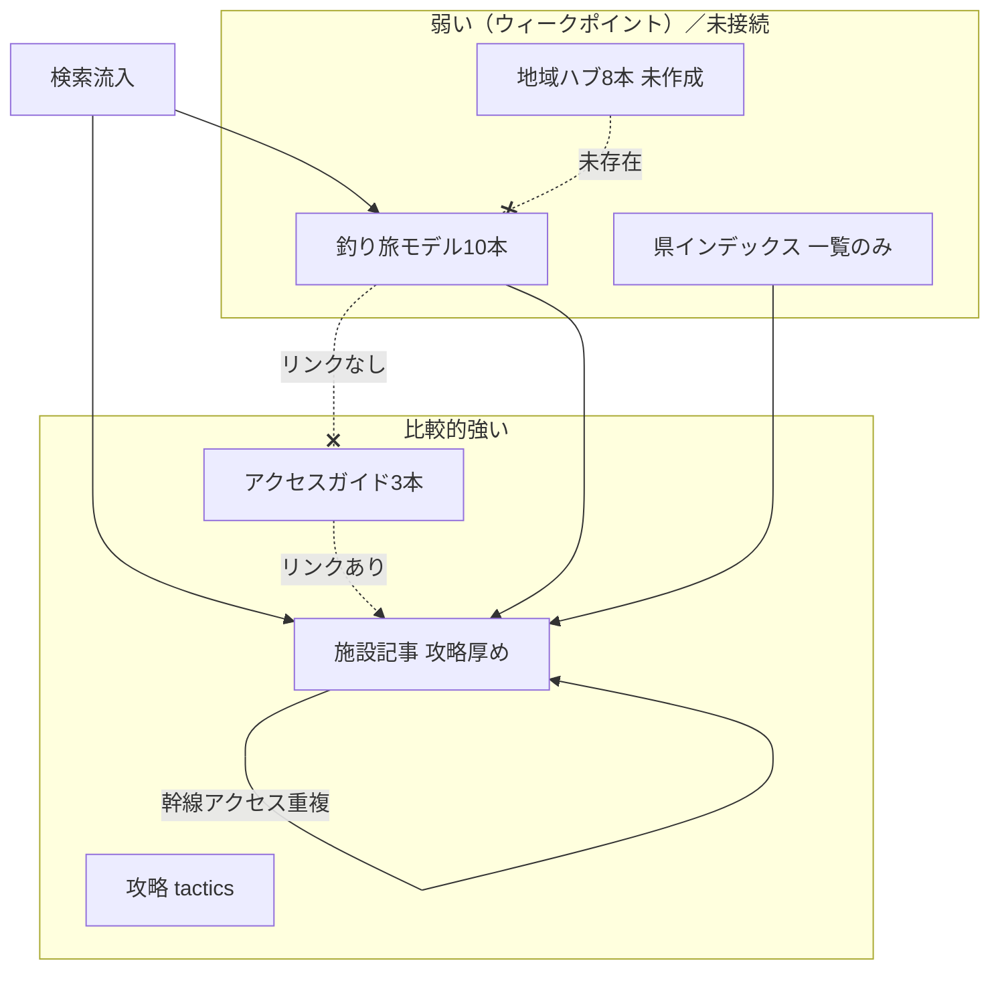

# travel カテゴリ成長プラン — アクセスハブ＋検索意図の網羅

**最終更新**：2026-05-28（travel 10本テンプレ適用・ステップ5完了。カテゴリ別品質ギャップ・サイト構造ボトルネック・着手順を追記。用語修正・スラッグ統一・URL統合基準・W3スコープ制限・フェーズ間Go/No-Go・E-E-A-T・技術SEO確認を補強）

---

## 0. 戦略の位置づけ（なぜこのタスクか）

### 現状認識

| 指標 | 状況 |
|------|------|
| セッション／PV | Hugo → Astro 移行直後の水準には**回復済み**。それ以上は伸びていない |
| GA4 インサイト | **ビジネスリーチ 100%** を狙うと、現状比 **約5倍** のリーチが見込める（ツール上のポテンシャル） |
| ギャップの仮説 | ① 既存記事の訴求力が **施設公式の海上釣り堀紹介** に劣る ② **ユーザーの悩みを直接解決するクエリ** のフォローが不足 |

### 目標（このタスクで達成したいこと）

1. **構造**：地域アクセスを **ハブ1本に集約**し、施設・モデルプランはラストマイル＋回遊に寄せる（従来方針を維持）。
2. **品質**：公式ページに負けない **比較・判断・実務情報** で travel／アクセス記事を再設計する。
3. **意図**：悩み解決型クエリ（行き方・初めて・子連れ・日帰り・予算・車なし等）を **記事マップで漏れなくカバー**し、ハブ・施設・攻略へ内部リンクでつなぐ。
4. **計測**：GA4 のビジネスリーチ・GSC のクエリ別 CTR／着陸を四半期ごとに見直し、**5倍はロードマップ上の北極星**（単発施策ではなく継続改善）。

### 成功の定義（KPI）

| KPI | 目安（初期） | 測定 |
|-----|--------------|------|
| ビジネスリーチ（GA4） | 現状比 **+50%**（1年）→ 中長期でポテンシャルに近づける | GA4 探索レポート |
| travel＋アクセスガイドのオーガニックセッション | 四半期 **+20%** | GA4 ランディングページ |
| 悩み解決クエリのカバー率 | 優先50クエリのうち **専用H2または子記事** がある割合 **80%** | クエリマスタ（スプレッドシート） |
| 公式に負けているページ | 競合監査リストの **高優先を0** | 四半期レビュー |
| ハブ8本＋既存13本の役割分担 | 重複段落ゼロ・相互リンク100% | 棚卸しシート |

---

## 1. なぜ5倍ポテンシャルに届いていないか（仮説の具体化）

### 1.1 公式紹介に負ける理由（コンテンツ品質）

施設公式・観光協会ページは **信頼・最新・写真・料金・予約導線** が揃っている。当サイトの travel／モデルプランは次が弱いと想定される。

| 弱点 | あるべき姿（差別化） |
|------|----------------------|
| 幹線アクセスの羅列だけ | **誰向けのおすすめルートか**（家族／竿ケース／日帰り／車なし）を表で明示 |
| 施設情報の二次転載感 | **複数施設の比較**・釣り堀選びの判断基準・失敗しやすい点 |
| 更新日・根拠が薄い | 公式URL・「○年○月時点」・ダイヤ確認手順（`deep-research-prompts.md` 準拠） |
| CTA が施設予約に届かない | ハブ → 施設 → 攻略の **3段導線** とアフィリエイト（交通・宿）の役割分担 |

### 1.2 悩み解決クエリのフォロー不足

「◯◯ 海上釣り堀 **行き方**」だけでなく、検索意図は次のクラスタに分かれる。**ハブ8本のH2だけでは足りない** ものは子見出し・FAQ・既存記事リライト・必要なら短い子記事で補う。

| 意図クラスタ | クエリ例 | 主な担い手 |
|--------------|----------|------------|
| 交通・ルート | 行き方、新幹線、レンタカー、フェリー | **地域アクセスハブ** |
| 初めて・不安 | 初心者、持ち物、服装、酔い | 攻略（tactics）＋ travel 導入 |
| 家族・子連れ | 子供 釣り堀、3歳、ベビー | travel モデルプラン再定位 |
| 日帰り・宿 | 日帰り、温泉ついで、モデルコース | travel 体験記事 |
| 費用・お得 | 料金 安い、パック、周遊券 | ハブの比較表＋アフィリ枠 |
| 施設選び | おすすめ、どこがいい、魚種 | 施設記事＋エリアまとめ |
| 時期・天候 | シーズン、荒れ、冬 | 施設・攻略 |

**アクション**：優先クエリ50件を GSC（過去16週）＋ GA4 の検索語から抽出し、**クエリ → URL → 不足（新規／リライト／H2追加）** の1枚マスタを作る（フェーズ0）。

---

## 2. 記事（ポスト）の品質 — カテゴリ別の「足りている／足りない」

**方針**：画像で勝負しない。**公式が薄い・雑な説明をテキストで補完**する（比較・判断・手順・注意）。既にリッチな `ise-shima-access-guide` を**品質の型**とする。

### 2.1 カテゴリ別マトリクス

| コレクション | 本数感 | 足りている | 足りない（公式に負けやすい） | 差別化の書き方 |
|--------------|--------|------------|------------------------------|----------------|
| **施設紹介** `fishing-facility` | 多数 | 料金表・魚種攻略・TackleCard・「選ばれる理由」 | **施設間比較**・誰向け／向かない人・予約の実務・幹線アクセスの重複薄文 | 公式の「地図1枚＋ICから◯分」→ 当サイトは**集合時間との整合・駐車・荷物・近隣他施設との違い** |
| **釣り旅ガイド** `column/travel`（モデル10本） | 10 | 観光・グルメ・タイムテーブル | **交通の判断**・施設選びの根拠・FAQ・アクセスガイドへの導線 | 観光ブログ調の一般論を削り、**比較表＋「あなたはどのタイプ」**を先頭に |
| **アクセスガイド** `travel/access` | 3 | 比較表・渋滞・読者タイプ・チェックリスト（伊勢志摩等） | **エリア8本への未展開**・モデルプラン／県インデックスからの**逆リンク不足** | 3本をテンプレ化し、地域ハブは**統合 or H2拡張**で増やしすぎない |
| **地域ハブ（未作成8本）** | 0 | — | 幹線＋施設比較＋FAQ の一式 | `access/*` と **1エリア1権威URL** を先に決めてから執筆 |
| **攻略** `tactics` | 多 | 釣り技術・道具 | **施設選び・初回の不安**と travel の接続 | `first-fishing-pond` 等から **エリア別施設・ハブ**へ1段落リンク |
| **豆知識** `column/trivia` | 10前後 | ニッチ知識 | travel／施設への導線 | 関連魚種攻略・施設へ「実践はこちら」 |
| **県・地方インデックス** `/fishing-facility/{region}/{pref}` | 自動生成 | 施設一覧・地図 | **編集テキスト**（県内の選び方・おすすめの切り口） | 後回し可。まず **1県パイロット**（三重）のみ |
| **Intelligence** | 週次 | トレンド | 恒常の悩みクエリ | travel 主戦場とは別。リンクのみ |

### 2.2 公式が弱く、テキストで勝てる領域（優先して書く）

公式・観光協会に無い／薄いものを**必須ブロック**にする。

1. **読者タイプ別の結論**（表：状況 → おすすめ手段）— `ise-shima-access-guide` の「先に結論」
2. **施設の比較**（料金帯・子連れ・竿ケース・放流・駐車・予約の厳しさ）— モデルプランの「注目施設」箇条書きを置き換え
3. **失敗パターン**（渋滞に間に合わない、電車で竿が厳しい、予約なし満席）
4. **手順チェックリスト**（出発前・帰路）
5. **一次情報への導線**（公式は載せないが、確認先は列挙）

### 2.3 品質チェックリスト（全ポスト共通・画像に頼らない）

- [ ] 読者像が1行で書けている
- [ ] 比較表が1つ以上（時間・費用・乗換・車なし可否 等）
- [ ] ルートは最大3本（最短／ゆったり／節約）— `deep-research-prompts.md` A-2
- [ ] **公式の薄い所**を1ブロック以上（上記 2.2 のいずれか）
- [ ] 内部リンク：ハブ ↔ 施設 ↔ 攻略 **最低3本・双方向**
- [ ] title / description が検索意図と一致
- [ ] **E-E-A-T**：情報の根拠・取得元（公式URL・「○年○月時点」）を本文内に明示
- [ ] **更新日**をフロントマターに記載し、ダイヤ・料金は変更時に必ず更新

**現状の実例**

- リッチ：`travel/access/ise-shima-access-guide`（表・渋滞・チェックリストあり）
- 薄い：`travel/ise-shima-model-plan`（施設が宣伝文・**アクセスガイド未リンク**・施設比較なし）
- 施設：`kaijo-tsuribori-benya` は攻略は厚いが、アクセスは IC＋50分程度のみ（幹線はハブへ寄せる前提）

---

## 2A. サイト構造のウィークポイント（ボトルネック）

| # | ボトルネック | 影響 | 効率の高い対処 |
|---|--------------|------|----------------|
| **W1** | **モデルプラン ↔ アクセスガイドが未連携**（例：伊勢志摩） | 良い記事が孤立、travel 全体が薄く見える | 既存3アクセス＋10モデルを**先に相互リンク＋役割分割**（新規8本より先） |
| **W2** | **釣り旅10本が「施設紹介の焼き直し」** | 公式・施設記事と差別化できず CTR 低下 | 比較表・選び方・FAQ を追加（画像増やさない） |
| **W3** | **施設の「アクセス情報と周辺ガイド」に幹線が残る** | 更新コスト・重複・薄い公式と同質化 | エリア単位で**ラストマイルのみ**＋ハブ1リンク |
| **W4** | **地域ハブ8本がゼロ** | 行き方クエリを3本＋施設に分散 | 8本一気に書かず **既存3本を東海/関東の核**に昇格 or 統合方針を決める |
| **W5** | **県インデックスに編集コンテンツなし** | 「◯◯県 おすすめ」意図を取りこぼし | 三重など**パイロット1県**のみ後追い |
| **W6** | **攻略 → travel／施設の導線が弱い** | 悩みクエリ（初心者・持ち物）が施設に流れない | `beginner/*` から定番3リンクをテンプレ化 |

**最大のウィークポイント**：**W1＋W2**（travel ポストの質と導線）。施設は本数が多いが攻略は既に厚い。**まず1エリアの「回廊」を通す**のが最も効率的。

---

## 2B. 効率的な着手順（実装ロードマップ）

**やらないこと（初期）**：8本ハブの一括新規、全施設のアクセス削除、県インデックスの全面リッチ化。

### ステップ1 — 型の固定（0.5〜1週間・実装ほぼ不要）

- [x] `ise-shima-access-guide` から **必須見出しセット**を抜き出し（結論表／手段別H2／チェックリスト／関連リンク）→ `travel-content-template.md` として同フォルダに1枚（2026-05-28 完了）
- [x] 競合差分：**公式10件チェック軸（A〜G）と伊勢志摩5件の差別化ポイント**を `travel-content-template.md` の「競合差分メモ」セクションに記載（残り5件は現地確認欄として確保）（2026-05-28 完了）

### ステップ2 — パイロット回廊「三重・伊勢志摩」（1〜2週間・最優先）

| 順 | 作業 | 理由 |
|----|------|------|
| 1 | `ise-shima-model-plan` 全面リライト：冒頭に読者タイプ表、施設**比較表**、FAQ、**`ise-shima-access-guide` へ prominent リンク** | W1・W2 を同時解消。新規URL不要 | ✅ 2026-05-28 完了 |
| 2 | モデルで触れる Mie 施設3〜5件：`アクセス` セクションを**ラストマイル＋ハブリンク**に短縮（辨屋・正徳丸・伝八屋等） | W3 を小範囲で検証 | ✅ 2026-05-28 完了（辨屋・正徳丸・伝八屋・佐助屋・トリトン 5件） |
| 3 | `ise-shima-access-guide`：関連にモデルプラン以外、**初心者攻略**を1本追加 | W6 の試験 | ✅ 2026-05-28 完了（first-fishing-pond 追加） |

**完了定義**：伊勢志摩関連クエリで「モデル／アクセス／施設」の3種が相互リンクし、モデルに比較表＋FAQがある。✅ **達成済み（2026-05-28）**

### ステップ3 — 関東回廊（2週間）

- [x] `chiba-minamiboso-access-guide` ↔ `chiba-minamiboso-trip` 接続完了（2026-05-28：trip リライト・双方向リンク・初心者リンク追加）
- [x] `hamanako-access-guide` ↔ `hamanako-unagi-trip` 接続完了（2026-05-28：trip リライト・双方向リンク・初心者リンク追加）
- [x] `kanagawa-miura-trip`：アクセス概要H2（車・京急・渋滞・チェックリスト）を記事内に追加。専用アクセスガイド整備まで暫定（2026-05-28）

### ステップ4 — 地域ハブの拡張方針（ステップ2・3の後）

- [x] **URL アーキテクチャ確定**（2026-05-28）
  - 既存3本（`ise-shima-access-guide` / `hamanako-access-guide` / `chiba-minamiboso-access-guide`）は**エリア詳細記事として存続**。リダイレクト不要。
  - 新規8本は「広域まとめ型ハブ」として階層の1段上に位置づける（広域ハブ → エリア詳細 → 施設）。
  - `access-kanto` は将来作成時に `chiba-minamiboso-access-guide`（千葉詳細）・`kanagawa-miura-trip`（三浦暫定）へリンク。
  - `access-tokai` は将来作成時に `ise-shima-access-guide`（三重詳細）・`hamanako-access-guide`（静岡詳細）へリンク。
- [x] **`access-kinki` 新規作成**（2026-05-28）：大阪近郊・淡路島・白浜の3サブエリア比較＋車／高速バス／特急くろしお／ジェノバラインを網羅。`awaji-family-trip` / `shirahama-onsen-trip` へのリンク配置済み。
- [x] **`access-kanto` 新規作成**（2026-05-28）：千葉・南房総／神奈川・三浦半島の2サブエリア比較。車（アクアライン・横横道路）・京急・JR内房線を網羅。施設4件（太海フラワー・オリジナルメーカー・三浦海王・城ヶ島JS釣り）へリンク配置。同日: 4施設のアクセスセクションに access-kanto リンク追加。chiba-minamiboso-access-guide / kanagawa-miura-trip にバックリンク追加。kanagawa-miura-trip のアクセス概要セクションを「暫定」表記から access-kanto への prominent リンクに更新。
- [x] **`access-tokai` 新規作成**（2026-05-28）：三重・伊勢志摩／静岡・浜名湖／愛知の3サブエリア比較。車7ルート・近鉄特急・新幹線を網羅。施設3件（爆釣美浜・新舞子・[篠島 ※閉店]）へリンク配置。同日: 愛知2施設・静岡2施設（araibenten=hamanako-access-guide経由、taikoubou=access-tokai直）のアクセスセクションにリンク追加。ise-shima-access-guide / hamanako-access-guide にバックリンク追加。篠島釣り天国は閉店済みのためリンク追加を省略。
- [ ] 残り3本（`access-hokuriku` / `access-shikoku` / `access-kyushu-okinawa`）は GSC需要上位から順に作成（ステップ5以降）

### ステップ5 — 横展開・計測

- [x] 残り travel 6本をテンプレ適用（2026-05-28 完了）
  - `awaji-family-trip`：施設比較2件・access-kinki リンク・FAQ・固定スラグ修正
  - `shirahama-onsen-trip`：施設比較3件・access-kinki リンク・FAQ
  - `fukui-mikata-goko`：アクセス概要H2（北陸道・サンダーバード）・施設比較3件・FAQ
  - `shimanami-cycling-fishing`：アクセス概要H2（しまなみ海道料金）・施設比較3件・FAQ
  - `kagawa-shodoshima-trip`：フェリーアクセス表4航路・施設比較3件・FAQ
  - `kumamoto-amakusa-trip`：アクセス概要H2（松橋IC・あまくさ号）・施設比較3件・FAQ
- [x] 施設は**ハブ／アクセスが整った県から**幹線削除（2026-05-28 完了）
  - 近畿7施設（tsuribori-kishu, kaijo-tsuribori-yuasa, awaji-janohire, kaijo-tsuribori-at-sea, kakata-fishing-pond, yura-sea-fishing-park, wakayama-marinacity）
  - 処理方針: 「ICから○分」「最寄り駅から徒歩○分」のラストマイルのみ保持 + access-kinki リンク追加
  - 例外: kaijo-tsuribori-yuasa（電車アクセスが固有価値）・kaijo-tsuribori-at-sea（徒歩アクセスが固有価値）は電車/徒歩情報を保持
- [x] `may-holiday-tsuribori-reservation` 孤立解消（2026-05-28）：本文に南伊勢・若狭湾のリンク追加、関連ページセクション新設（7リンク）
- [ ] フェーズ0 KPI・クエリマスタで効果確認

---

## 3. 情報設計（ハブ・既存記事・施設の役割）— 従来方針の維持

**目的**：「◯◯地方・エリアへの最適なアクセス方法」を **検索・回遊のハブ**として独立させ、施設記事は **ラストマイル＋要約**に寄せる。アフィリエイト（交通・宿・レンタカー等）は **ハブ側に集約**。

**既存カテゴリ**：`src/content/blog/column/travel/`。アクセス専用は **`アクセスガイド`**（または `travel/access/` で区別）を定義してから統一。

### 3.1 既存 `column/travel` との競合（2026-04-16 棚卸し＋方針）

**モデルプラン／体験記事（10本）** はアクセス専用ハブではないが、導入・本文に移動説明があり **地域ハブと題材が重複** する。

**`travel/access/*`（3本）** はアクセス特化。下記 TODO は主に10本向け。アクセスガイド同士・地域ハブ8本との整合は別途。

#### 重複リスク「高」— ハブと二重化しやすい（優先対応）

※ 記事は作成済みだが **地方アクセスハブ8本が未完了** のため、ハブ優先で役割分担を確定すること。

- [x] **`ise-shima-model-plan`**（三重・伊勢志摩）幹線アクセス長文なし（既に ise-shima-access-guide に誘導済み）。access-tokai リンクを関連ページに追加（2026-05-28）。構造は良好（比較表・FAQ・5施設リンク）
- [x] **`hamanako-unagi-trip`**（静岡・浜名湖）access-tokai リンクを関連ページに追加（2026-05-28）。グルメ×釣行の独自価値（うなぎ釣り体験・1泊2日）は既に前面化済み
- [x] **`chiba-minamiboso-trip`**（千葉・南房総）access-kanto リンクを関連ページに追加（2026-05-28）。構造は良好（比較表・日帰り+1泊モデル・FAQ）
- [x] **`kanagawa-miura-trip`**（神奈川・三浦）アクセス概要の「暫定」注記を access-kanto への prominent リンクに更新済み（2026-05-28）。幹線長文削除は access-kanto 確定後の次フェーズで実施

#### 重複リスク「中〜高」

- [x] **`fukui-mikata-goko`**（福井・若狭）北陸ハブとの重複整理。アクセス概要H2を記事内に追加（サンダーバード＋北陸道）。若狭ぐじ・天然うなぎの独自価値を前面に（2026-05-28 完了）

#### 重複リスク「中」

- [x] **`awaji-family-trip`**（淡路島）— 家族向けストーリー＋access-kinki ハブリンク（2026-05-28 完了）
- [x] **`shirahama-onsen-trip`**（和歌山・白浜）— 温泉・宿泊軸＋access-kinki ハブリンク（2026-05-28 完了）
- [x] **`shimanami-cycling-fishing`**（しまなみ）— アクセス概要H2追加（しまなみ海道通行料）・四国・中国ハブ準備中の注記（2026-05-28 完了）
- [x] **`kagawa-shodoshima-trip`**（香川・小豆島）— フェリー4航路表追加・四国ハブ準備中の注記（2026-05-28 完了）
- [x] **`kumamoto-amakusa-trip`**（熊本・天草）— アクセス概要H2追加（あまくさ号・宝島ライン）・九州ハブ準備中の注記（2026-05-28 完了）

#### 棚卸し・漏れ確認

- [ ] モデルプラン10本が上記 TODO と1:1対応（`slug` 照合）
- [ ] **`travel/access/` 3本** と地域ハブ8本・10本の **内部リンク・重複表現** 整理

### 3.2 施設記事（`fishing-facility`）

同名に近い **「アクセス情報と周辺ガイド」** セクションで遠方幹線まで書いている場合は、**ラストマイル＋ハブリンク** に全面寄せ（別タスクと連携）。

---

## 4. 新規：地域アクセスハブ記事リスト（8本）

| # | 想定スラッグ（案） | カバー範囲 | 主な内部リンク先 |
|---|-------------------|------------|------------------|
| 1 | `access-hokkaido-tohoku` | 北海道・東北 | `east-japan/hokkaido/*` 等 |
| 2 | `access-kanto` | 関東（茨城・千葉・神奈川・東京近郊）**首都圏発主軸** | 関東 `fishing-facility` |
| 3 | `access-tokai` | 東海（静岡・愛知・三重） | 三重・静岡・愛知 |
| 4 | `access-hokuriku` | 北陸 | `center-japan/fukui/*` 等 |
| 5 | `access-kinki` | 近畿・関西 | `west-japan` 近畿 |
| 6 | `access-chugoku` | 中国地方 | 広島・山口・岡山 等 |
| 7 | `access-shikoku` | 四国 | 四国各県 |
| 8 | `access-kyushu-okinawa` | 九州・沖縄 | 九州・沖縄 |

**補足**：需要が分かれれば沖縄単独（9本目）可。起点別（名古屋発等）は **H2 で吸収**（記事数膨張を抑制）。

**各ハブの必須構成（テンプレ）**

1. 概要（誰向け・エリアの釣り堀の特徴1段落）
2. 起点別 H2（首都圏／名古屋／大阪等）
3. ルート比較表（最短／ゆったり／節約）
4. 周遊券・パック（アフィリ導線）
5. **おすすめ海上釣り堀**（比較の観点付きリンク一覧）← 公式を上回る核
6. よくある質問（悩みクラスタから3〜5問）
7. 関連：モデルプラン・攻略・施設

調査手順：`deep-research-prompts.md`、既存 `research-file/` をエリアごとに流用。

### ハブ新規作成時の運用ルール

> **ハブ記事の作成と、対応施設記事へのリンク追加は同一ステップで完結させる。**

| # | 作業 | タイミング |
|---|------|-----------|
| 1 | ハブ記事を作成し、`施設比較リスト` に掲載する施設を確定する | ハブ執筆時 |
| 2 | リスト掲載の全施設記事のアクセスセクションに「▶ [ハブ名](ハブURL)」を追加する | ハブ公開と同日 |
| 3 | 対応するモデルプラン記事にハブへのリンクを追加する（未追加の場合） | 同上 |

**ルールの背景**：Step 4 で `access-kinki` を新規作成した際、施設記事の更新を「幹線削除」という別ステップに先送りしたため、ハブ存在→施設逆リンクゼロという片方向リンク状態が約8施設分発生した。「ハブ作成」と「施設更新」を分離しないことでこの状態を防ぐ。

**施設側の更新パターン**（ラストマイル＋ハブリンク）：
- ラストマイル：「最寄りIC/駅から○分・駐車場△台」のみ残す
- 電車/徒歩が固有価値の施設（例：駅徒歩15分型）は電車アクセスを保持し、車ルートをハブへ誘導
- 追加文：`遠方からのルート・渋滞情報は ▶ [○○アクセスガイド](/column/travel/access/[slug]) で詳しく解説しています。`

---

## 5. 重複時の方針：新規ハブ優先で既存を「作り直す」

**原則**：地域アクセスの権威は **ハブ1本（上表粒度）に集約**。重複時は追記修正ではなく **構成ごと再設計**。

- **新規ハブ**：幹線・料金比較・切符・レンタカー・宿・アフィリ・**施設比較**
- **既存 travel 10本**：モデルコース・グルメ・観光・体験専用。幹線長文は削除 → ハブへ（要約＋リンク1〜2段落）
- **`travel/access/` 3本**：8本ハブとの **統合 or リダイレクト方針** をフェーズAで決定（重複URLを増やさない）
- **施設記事**：最寄りIC・駅・駐車場・固有注意 ＋「遠方からは▶該当ハブ」

---

## 6. 実行フェーズ（チェックリスト）

### フェーズ0：計測・クエリマスタ（最優先・1〜2週間）

- [ ] GA4：ビジネスリーチの現状値と **100%到達時の見込み** をスクリーンショット／数値で記録（ベースライン）
- [ ] GSC：travel／アクセス／施設の **クエリ別インプレッション・CTR・順位** をエクスポート
- [ ] **優先クエリ50件** を選定（インプレッション上位＋悩みクラスタの穴）
- [ ] **クエリ → 担いURL → ギャップ（新規／リライト／H2／FAQ）** のマスタ1枚
- [ ] 競合監査：**公式施設ページ vs 当該URL** を高10件（タイトル・比較表・写真・更新・予約導線）で差分メモ
- [ ] **技術SEO確認**：GSC の Core Web Vitals レポートで travel／施設 URLに「要改善」「不良」がないことを確認（Astro移行済みで問題ない想定だが、一度スクショで記録しておく）

### フェーズA：棚卸し・競合の確定

- [ ] `column/travel/**/*.mdx` の **幹線アクセス段落** を一覧化
- [ ] `fishing-facility/**/*.mdx` で遠方ルート記述がある施設をリスト化
- [ ] 上記と **8本ハブ** の対応表（1枚）
- [ ] **URL設計**：`slug`・`category`（`アクセスガイド`）を `category-rules.md` に追記案
- [ ] `travel/access/` 3本の **統合方針** 決定（判断基準：GSCで過去16週のオーガニッククリックが **月10以上** あるURLはリダイレクト不可・内容を新ハブに吸収して既存URLを存続 or 正規化。クリックゼロ／極小ならハブへ301リダイレクト）

### フェーズB：パイロット回廊＋ポスト品質（§2B ステップ2〜3。8本ハブ一括はしない）

- [ ] **三重回廊**：`ise-shima-model-plan` リライト（比較表・FAQ・アクセスガイド双方向リンク）
- [ ] **三重回廊**：伊勢志摩関連施設3〜5件のアクセス欄をラストマイル化（**W3パイロット**：5件で完了。全施設横展開はフェーズC以降・ハブ整備済みエリアのみ）
- [ ] **関東回廊**：南房総・浜名湖の access ↔ trip 接続、`kanagawa-miura-trip` に暫定アクセス表
- [ ] **悩みクエリ**：マスタで「不足」のものを **既存記事のH2／FAQ** で10件以上（新規URL最小）
- [ ] **新規ハブ**：GSC需要上位エリアのみ1〜2本（§4）。3本の `travel/access` との統合方針後
- [ ] **Go/No-Go チェック**（三重回廊完了から **8週後**）：GSCで「伊勢志摩 海上釣り堀 行き方」等の関連クエリ順位・CTRに改善傾向があるか確認。変化なければ **仮説（W1・W2）を再検討**してからステップ3に進む

### フェーズC：残り6本・中優先クエリ

- [ ] travel モデルプラン残り6本を §3.1 TODO 順にリライト
- [ ] クエリマスタ **カバー率80%** まで追加対応
- [ ] 攻略（tactics）から travel ハブへの **意図別リンク**（初心者・持ち物等）を相互に整備

### フェーズD：計測・保守・伸長

- [ ] GSC：「◯◯ 海上釣り堀 行き方」等の着陸がハブ／施設のどちらかモニタ
- [ ] GA4：四半期ごとにビジネスリーチ・travelセッションをレビュー（§0 KPI）
- [ ] ダイヤ・料金改定は **ハブのみ更新** ルールを施設側に明文化
- [ ] 競合監査リストを四半期更新（公式の改修に追従）

---

## 7. 優先順位（推奨着手順）— §2B と整合

1. **フェーズ0**（軽量で可）：ベースライン＋クエリマスタ50件
2. **ステップ1**：`ise-shima-access-guide` からテンプレ1枚
3. **ステップ2**：三重回廊（モデルリライト → 施設アクセス短縮 → 攻略リンク）
4. **ステップ3**：関東回廊（access 3本中2本＋三浦）
5. **ステップ4以降**：需要順に地域ハブ1〜2本／残り travel／施設横展開

**原則**：新規URLを増やす前に、**既存13 travel ポストのテキスト密度と導線**を直す。ここが最大のウォークポイント（W1・W2）。

---

## 8. 参照パス

- 既存 travel：`src/content/blog/column/travel/*/index.mdx`
- 交通調査プロンプト：`.workspace/.task/travel-category/deep-research-prompts.md`
- 調査レポート：`/.workspace/.task/travel-category/research-file/`
- カテゴリ運用：`.agents/skills/category-rules.md`
- インデックス・品質基盤：`.workspace/.task/content-expansion-roadmap.md`
- 施設ルート：`/fishing-facility/...`
