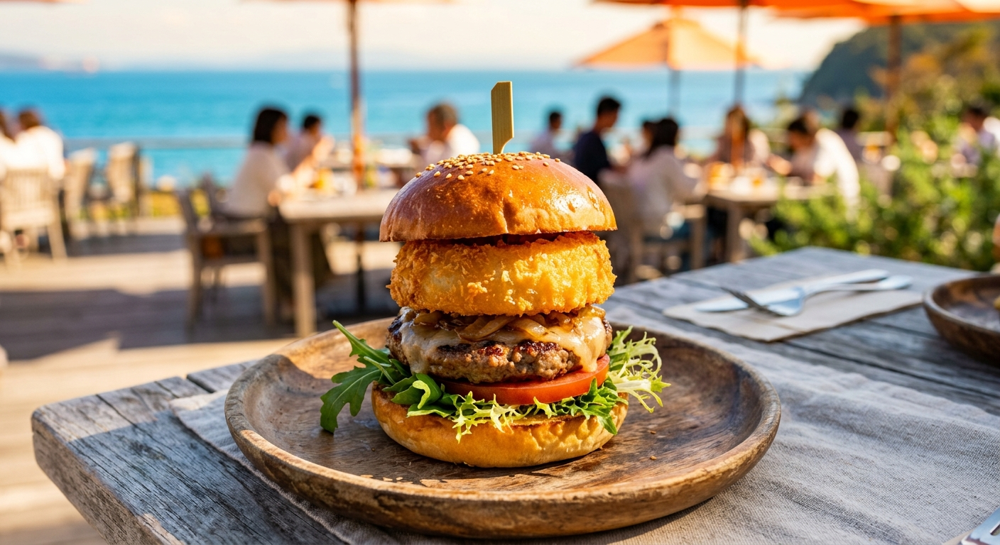

## はじめに
明石海峡大橋を渡れば、そこはもうアイランド・リゾート。淡路島は、ファミリーフィッシングに最適な海上釣り堀の宝庫でもあります。

「パパは釣りをしたいけれど、ママと子供が飽きちゃうかも…」そんな心配は無用！今回は、本格的な釣りから絶品グルメ、そして広大な公園遊びまで、家族みんなが欲張りに楽しめる<strong>「淡路島週末満喫プラン」</strong>をご紹介します。

## 海上釣り堀：足場が良く家族も安心
淡路島の釣り堀は、足場が舗装されていたり、トイレが完備されていたりと、初心者や子供に優しい施設が多いのが特徴です。

### ファミリーにおすすめの施設
- <strong>[淡路じゃのひれフィッシングパーク](/fishing-facility/awaji-janohire-fishing-park)</strong>: 
  淡路島南端にある「じゃのひれアウトドアリゾート」内にある施設。足場が抜群に良く、マダイが確実に狙える「ファミリーコース」や、手ぶらでOKなレンタルも充実。スタッフさんのサポートも手厚く、初めての釣り堀に最適です。
- <strong>[淡路島観光ホテル](https://www.awajikan-ko.com/fishing/)</strong>: 
  「日本一のフィッシングホテル」として有名。宿泊者専用のプライベート釣り場があり、ホテルスタッフが常駐してサポートしてくれます。夜釣りや朝食前のちょい釣りなど、宿泊ならではの楽しみ方ができます。

## ランチ：淡路島たまねぎの甘みに感動
淡路島に来たら外せないのが「たまねぎ」です。特に「うずの丘 大鳴門橋記念館」周辺は、たまねぎグルメと映えスポットの宝庫！

- <strong>淡路島バーガー（オニオンキッチン）</strong>: 
  全国ご当地バーガーグランプリで1位に輝いたこともある逸品。サクサクのたまねぎカツの甘みとジューシーな淡路牛の相性は抜群です。
- <strong>たまねぎ丸ごと煮込みカレー</strong>: 
  たまねぎを贅沢に1個まるごと、コンフィやスープで楽しめるレストランも。子供でも食べやすい甘みが特徴です。

## アクティビティ：あわじ花さじき・国営明石海峡公園
釣りの後は、広大な敷地で思い切り遊びましょう。

- <strong>あわじ花さじき</strong>: 
  広大な丘一面に広がる季節ごとの花々（春は菜の花、夏はひまわり等）と、青い海のコントラストが絶景。家族写真の撮影スポットとして最高です。
- <strong>国営明石海峡公園（夢っこランド）</strong>: 
  子供たちが大興奮する巨大な遊具エリア。150もの遊具が組み合わさった大型複合遊具があり、パパが片付けをしている間にママと子供で遊び尽くす、といった使い方もおすすめです。

## おすすめの1泊2日モデルコース

| 時間 | 1日目：釣りとグルメ | 2日目：遊びと絶景 |
| :--- | :--- | :--- |
| <strong>AM</strong> | 淡路じゃのひれで海上釣り堀体験 | 国営明石海峡公園で全力遊び！ |
| <strong>昼食</strong> | うずの丘で「あわじ島バーガー」 | 淡路島特製しらす丼を堪能 |
| <strong>PM</strong> | ホテルへ・温泉でゆったり | あわじ花さじきで絶景フォト |
| <strong>夕刻</strong> | ホテルの釣り場で夕まずめ狙い | お土産（もちろんたまねぎ）を購入 |

## まとめ
淡路島は「釣る・食べる・遊ぶ」が高次元で融合した、まさにファミリーフィッシングの聖地です。

しっかり整備された海上釣り堀なら、パパも安心して大物に挑めますし、子供たちが魚の引きに驚く笑顔は何物にも代えがたい宝物になります。次の週末、明石海峡大橋を渡って家族の絆を深める「淡路島大冒険」に出かけてみませんか？
