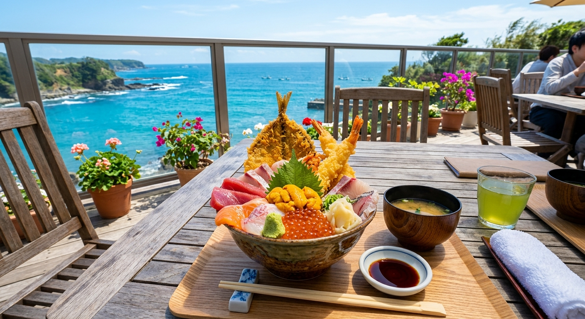

## はじめに
千葉県、南房総（南房）エリアは、都心から最も近い本格的な海のレジャーエリアです。アクアラインを使えば、わずか1時間強で別世界のような美しい海と豊かな自然が待っています。

「今度の週末、どこか遠くに旅行したいけれど、運転が大変なのはちょっと…」そんなパパにもおすすめ！サクッと行ける南房総の釣り×観光満喫プランをご提案します。

## 海上釣り堀：南房総の本格派イケス
南房総エリアは、外海からの荒波と豊かな黒潮の恩恵を受けた魚たちが集まります。

### 注目施設
- <strong>[太海フラワー磯釣りセンター](/fishing-facility/east-japan/chiba/futomi-flower-isotsuri-center)</strong>: 
  鴨川市にある非常にユニークな施設。手ぶらで訪れて「キャッチ＆リリース（釣り上げた魚は逃がす）」で楽しむスタイルです。1,500円とリーズナブルで、マダイやイサキ、シマアジの引きを誰でも手軽に味わえます。お子様の「人生初ヒット」の思い出づくりに最適。
- <strong>[九十九里海釣りセンター](http://www.99uriku.com/)</strong>: 
  南房総からは少し距離がありますが、千葉県最大の人気を誇るのがここ。海水を引いた巨大な陸上池で、マダイや青物、さらには高級魚のヒラメや伊勢海老まで放流されることも。50種類以上の魚種が狙える、まさに「魚のデパート」です。
- <strong>[オリジナルメーカー海釣り公園](/fishing-facility/east-japan/chiba/original-maker-sea-fishing-park)</strong>: 
  （市原市海づり施設）南房総への道中にある、関東屈指の人気を誇る海釣り施設。釣り堀ではありませんが、整備された足場と魚影の濃さで、ファミリー層から圧倒的な支持を得ています。

## グルメ：房総といえば「なめろう」と「はみ出し海鮮丼」
釣りの後は、房総自慢の地魚ランチに舌鼓！

- <strong>アジのなめろう</strong>: 
  アジを味噌や薬味と叩いた房総の郷土料理。ご飯にはもちろん、酒の肴にも最高です。富津エリアで有名な「黄金アジ（脂ののったアジ）」を使ったなめろうは別格の味わい。
- <strong>はみ出し海鮮丼</strong>: 
  千倉や鴨川の漁港近くには、丼から魚が溢れ出すほど贅沢な海鮮丼を出す名店が目白押し。地元の漁港で揚がったばかりの鮮度を堪能してください。
- <strong>カフェランチ</strong>: 
  白浜や野島埼周辺には、お洒落な海見えカフェも急増中。女性やお子様も喜ぶプランが立てやすいですよ。

## 観光：道の駅巡りと野島埼灯台
南房総は「道の駅」の圧倒的な集積地。

- <strong>道の駅 鴨川オーシャンパーク</strong>: 
  貝殻のような不思議な形をした道の駅。足湯や、子供が水遊びできる噴水、さらにはサザエのつぼ焼きを楽しめるコーナーもあり、休憩スポットとして優秀です。
- <strong>野島埼灯台（房総半島最南端）</strong>: 
  真っ白な灯台の周辺は散歩道になっており、太平洋の水平線を180度見渡せます。岩場にポツンと置かれたベンチは、絶景のフォトスポットとして有名です。

## おすすめの1泊2日モデルコース

| 時間 | <strong>1日目：釣りと鴨川観光</strong> | <strong>2日目：南端絶景と道の駅</strong> |
| :--- | :--- | :--- |
| <strong>AM</strong> | 太海フラワーで「人生初キャッチ」！ | 野島埼灯台で太平洋の大パノラマ |
| <strong>昼食</strong> | 鴨川港周辺で「地魚三昧ランチ」 | ローズマリー公園で洋風ランチ |
| <strong>PM</strong> | 鴨川シーワールドでシャチに驚愕 | 道の駅をハシゴしてお土産爆買い |
| <strong>夕刻</strong> | 白浜の絶景温泉ホテルへチェックイン | アクアラインの渋滞を避けて早めの帰路 |

## まとめ
思い立ったらすぐ行ける、都心から一番近い海のリゾート南房総。手軽な海上釣り堀で高級魚の引きを味わい、新鮮な海の幸でお腹を満たし、絶景の中で家族の思い出を刻む。次の週末、迷わずアクアラインを渡ってみませんか？
