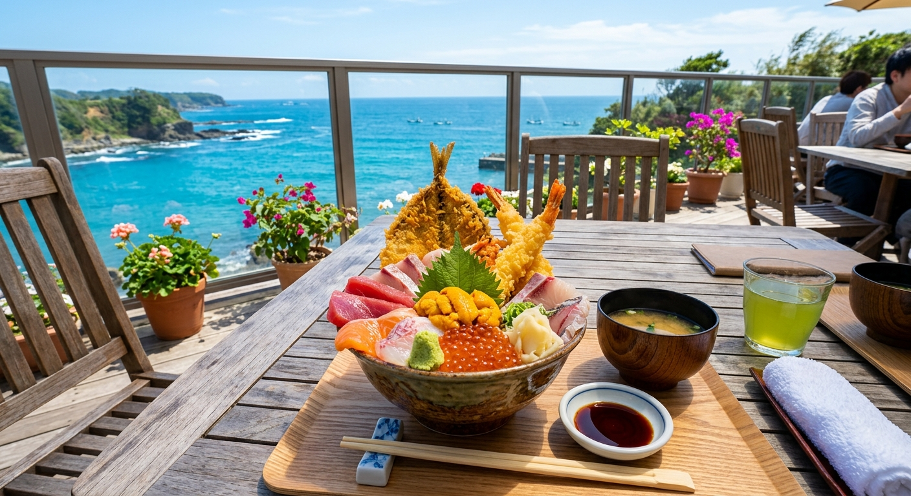

南房総は都心から最も近い本格的な海のレジャーエリア。アクアラインを使えば1時間強で別世界の海が待っています。ただし「どの施設を選ぶか」「日帰りか1泊か」で体験の質が大きく変わります。

移動手段（車・特急・高速バス・アクアライン渋滞情報）の詳細は別記事にまとめています。  
▶ **[南房総アクセス完全版（車・特急・高速バスの比較）](/column/travel/access/chiba-minamiboso-access-guide)**

---

## このガイドが向いている人

| あなたの状況 | このガイドの使い方 |
| :--- | :--- |
| 南房総に初めて行く | 比較表→モデルコースの順に読む |
| 子供に「初めての釣り体験」をさせたい | 比較表の「子連れ ◎」施設を選ぶ |
| 海鮮グルメ・観光もセットで楽しみたい | グルメ・観光セクションへ |
| 日帰りか1泊か迷っている | モデルコース表で両方を比較 |
| **アクセス・移動手段を調べたい** | **→ [南房総アクセスガイド](/column/travel/access/chiba-minamiboso-access-guide)** |
| **釣り初心者で何も分からない** | **→ [初めての海上釣り堀ガイド](/tactics/beginner/first-fishing-pond)** |

---

## 南房総の施設比較：あなたに向いているのはどこ？

施設によってスタイルが大きく異なります。目的に合わせて選んでください。

| 施設 | タイプ | エリア | 向いている人 | 子連れ | アクセス |
| :--- | :--- | :--- | :--- | :--- | :--- |
| **[太海フラワー磯釣りセンター](/fishing-facility/east-japan/chiba/futomi-flower-isotsuri-center)** | 磯釣り公園 | 鴨川市・太海 | 手ぶら・初心者・子連れ・体験重視 | ◎ | 安房鴨川駅からタクシー約10分 |
| **[九十九里海釣りセンター](http://www.99uriku.com/)** | 陸上イケス | 九十九里 | 本格釣り・多魚種・じっくり楽しみたい | ○ | 車必須 |
| **[オリジナルメーカー海釣り公園](/fishing-facility/east-japan/chiba/original-maker-sea-fishing-park)** | 海釣り公園 | 市原市 | ファミリー・道中の立ち寄り・サビキ中心 | ◎ | 館山道の道中 |

> **迷ったら**：初めてなら手ぶらOKの**太海フラワー**（1,500円〜で気軽）。本格的な大物を狙うなら**九十九里**。移動途中に寄るだけなら**オリジナルメーカー**。

---

## おすすめのモデルコース

### 日帰りプラン（都心からアクアライン往復）

| 時間 | 行動 |
| :--- | :--- |
| 06:00 | 都心出発（アクアライン渋滞前に通過） |
| 07:30〜08:00 | 太海フラワーまたは施設に到着・受付 |
| 08:00〜12:00 | 釣り（午前の放流タイム） |
| 12:30 | 鴨川港周辺で地魚ランチ（はみ出し海鮮丼） |
| 14:00 | 野島埼灯台・道の駅でお土産 |
| 15:00前 | アクアライン渋滞のピーク前に帰路へ |

### 1泊2日プラン（渋滞を避けてゆったり）

| 時間 | **1日目：釣りと鴨川観光** | **2日目：南端絶景と道の駅** |
| :--- | :--- | :--- |
| **AM** | 太海フラワーで「人生初キャッチ」 | 野島埼灯台で太平洋の大パノラマ |
| **昼食** | 鴨川港周辺で地魚三昧ランチ | 道の駅のサザエつぼ焼き・テイクアウト |
| **PM** | 鴨川シーワールドでシャチに驚愕 | 道の駅をはしごしてお土産 |
| **夕刻** | 白浜の絶景温泉ホテルへチェックイン | アクアライン渋滞を避けて早めの帰路 |

**1泊の最大メリット**：帰路の渋滞（15〜19時の木更津〜海ほたる）をまるごと回避できる。翌朝9時以降に出発すると渋滞がほぼ消えています。

---

## グルメ：房総で必ず食べたい3品

### アジのなめろう

アジを味噌・薬味と叩いた房総の郷土料理。富津エリアで獲れる「黄金アジ」は脂のりが別格。単品700〜900円台の店が多く、ご飯にも酒にも合います。

### はみ出し海鮮丼

千倉・鴨川の漁港近くの食堂で供される、丼から魚が溢れ出す豪快な一品。地元の当日水揚げ物を使う店が多く、同じ値段で都市部の2倍量を食べられます。1,500〜2,500円台。

### サザエつぼ焼き（道の駅）

南房総の道の駅では焼き台が置かれた店舗が多く、1個300〜400円で磯の香りをその場で楽しめます。釣り後のソフトドリンク休憩と合わせると◎。

---

## 観光：道の駅と野島埼灯台

### 野島埼灯台（房総半島最南端）

白い灯台の周辺は遊歩道になっており、太平洋の水平線を180度見渡せます。灯台に登れる（有料）ため、子供の記念体験にも向いています。所要30〜45分。

### 道の駅めぐり

南房総は道の駅の密集地。「鴨川オーシャンパーク」は貝殻型の建物で足湯・噴水あり。「南房パラダイス」「ちくら・潮風王国」など、館山道沿いに複数まとめて立ち寄れます。

---

## よくある質問（FAQ）

**Q1. 電車だけで釣り施設まで行けますか？**  
特急わかしお（安房鴨川行き）＋タクシーで太海フラワーへはアクセス可能です。ただし竿ケース・クーラーが多い場合は車推奨。詳細は▶ [南房総アクセスガイド](/column/travel/access/chiba-minamiboso-access-guide)

**Q2. アクアラインのETC料金はいくらですか？**  
ETC搭載車は普通車640円（恒久割引）。未搭載は3,140円。詳細は▶ [南房総アクセスガイド](/column/travel/access/chiba-minamiboso-access-guide)

**Q3. 子供が初めてなのですが、どこがおすすめですか？**  
太海フラワー磯釣りセンターが最適です。手ぶら・リーズナブル（1,500円〜）で、スタッフのサポートも手厚く、小学生以下の初ヒット体験に最適です。

**Q4. 日帰りと1泊どちらがおすすめですか？**  
週末の帰路渋滞（15〜19時）が最大の懸念。釣りを朝イチで済ませて13時台に帰路に就ける人は日帰り可能。それ以外は1泊のほうが渋滞ストレスを大幅に削減できます。

**Q5. 釣り道具がなくても大丈夫ですか？**  
太海フラワーは手ぶらOK（レンタルあり）。九十九里もレンタルタックルに対応しています。

---

## 関連ページ

- **[関東アクセスガイド（千葉・神奈川の広域比較）](/column/travel/access/access-kanto)**
- **[南房総アクセス完全版（車・特急・高速バスの比較）](/column/travel/access/chiba-minamiboso-access-guide)**
- 太海フラワー磯釣りセンター: [/fishing-facility/east-japan/chiba/futomi-flower-isotsuri-center](/fishing-facility/east-japan/chiba/futomi-flower-isotsuri-center)
- オリジナルメーカー海釣り公園: [/fishing-facility/east-japan/chiba/original-maker-sea-fishing-park](/fishing-facility/east-japan/chiba/original-maker-sea-fishing-park)
- 初めての海上釣り堀ガイド: [/tactics/beginner/first-fishing-pond](/tactics/beginner/first-fishing-pond)
