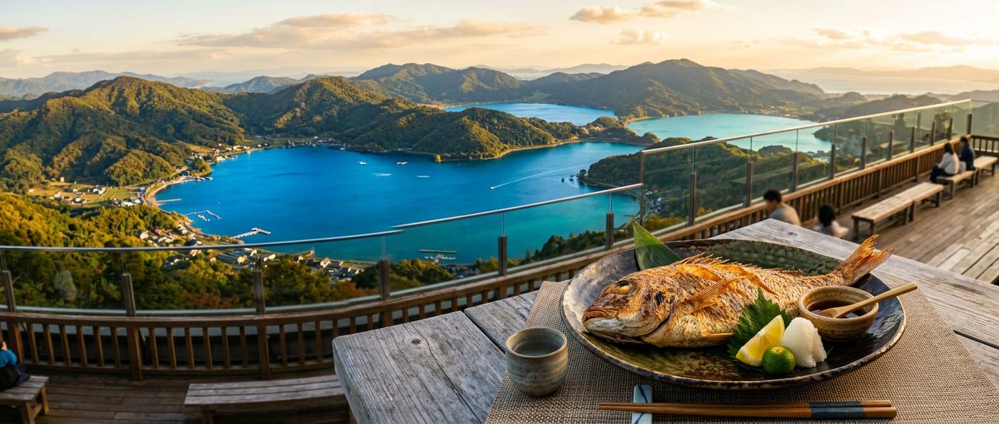

## はじめに
福井県若狭地方は、かつて「御食国（みけつくに）」と呼ばれ、都に新鮮な食材を送り届けていた歴史があります。その豊かな海の恵みは今も健在で、特に三方五湖（みかたごこ）周辺は、穏やかな湖面とダイナミックな日本海の両方を楽しめる稀有なエリアです。

今回は、パパも子供も大満足間違いなしの、若狭湾での海上釣り堀体験と絶品グルメを巡る欲張り旅をご提案します。

## 海上釣り堀：日本海を望む絶景イケス
若狭湾エリアは海上釣り堀が非常に充実しており、初心者からベテランまでレベルに合わせた施設選びが可能です。

### 注目施設
- <strong>[フィッシングランド日向](/fishing-facility/center-japan/fukui/fishing-land-hyuga)</strong>: 
  三方五湖の一つ「日向湖」にある、日本海側最大級の海上釣り堀。潮通しが良く、魚の活性が高いことで有名です。マダイやブリはもちろん、季節によっては豪華な高級魚の放流もあり、爆釣の期待が高まります。
- <strong>[ブルーパーク阿納](/fishing-facility/center-japan/fukui/blue-park-ano)</strong>: 
  「民宿の町」として知られる阿納にある、非常にアットホームな施設。釣り堀体験だけでなく、釣った魚をその場で捌いて食べさせてくれる「食育」プランもあり、お子様の釣りデビューに最適です。
- <strong>[フィッシングレインボー](/fishing-facility/center-japan/fukui/fishing-rainbow)</strong>: 
  レインボーライン登り口のすぐそばに位置する好立地。観光の合間に本格的な海上釣り堀を楽しめるため、旅行プランに組み込みやすいのが魅力です。

## グルメ：若狭ぐじ（甘鯛）と三方五湖のうなぎ
福井に来たら、ここでしか味わえない「本物の味」に触れてください。

- <strong>若狭ぐじ（甘鯛）</strong>: 
  京料理の最高級食材として珍重される若狭の甘鯛。身が柔らかく甘みが強いのが特徴で、刺身はもちろん、鱗をパリパリに焼き上げた「鱗焼き」は絶品です。
- <strong>三方五湖の天然うなぎ</strong>: 
  ここ三方五湖は「口細青うなぎ」と呼ばれる天然うなぎが獲れることでも有名。肉厚で脂がのりつつも、しつこくない味わいは一度食べたら忘れられません。
- <strong>ソースカツ丼（ヨーロッパ軒）</strong>: 
  福井のソウルフードといえばこれ。薄く叩いたカツに秘伝のタレが染み込み、ご飯が進みます。子供も大好きな味です。

## 観光：レインボーライン山頂公園で「天空の足湯」
釣りの後は、標高約400m、三方五湖と日本海を一望できるパノラマビューへ。

- <strong>三方五湖レインボーライン</strong>: 
  山頂公園へはリフトやケーブルカーで向かいます。山頂には「天空の足湯」があり、絶景を眺めながら旅の疲れを癒やす時間はまさに至福。五つの湖がそれぞれ異なる青色を見せる様子は、SNS映え間違いなしの美しさです。

## おすすめの1泊2日モデルコース

| 時間 | <strong>1日目：釣りと歴史</strong> | <strong>2日目：絶景と癒やし</strong> |
| :--- | :--- | :--- |
| <strong>AM</strong> | フィッシングランド日向で大物狙い | 三方五湖レインボーラインへ |
| <strong>昼食</strong> | 阿納の民宿で「魚づくしランチ」 | 湖畔の老舗で「天然うなぎ」を堪能 |
| <strong>PM</strong> | 瓜割の滝でマイナスイオンを浴びる | 若狭鯖街道の宿場町「熊川宿」散策 |
| <strong>夕刻</strong> | 若狭の温泉宿でゆったり一泊 | 敦賀ICを目指してお土産購入 |

## まとめ
歴史と自然が交差する福井・若狭。日本海の荒波に育まれた力強い魚たちとの格闘、そして古来より都を支えた至極の食文化。次の週末は、少し足を伸ばして「本物の日本」を感じる若狭の旅に出かけてみませんか？
