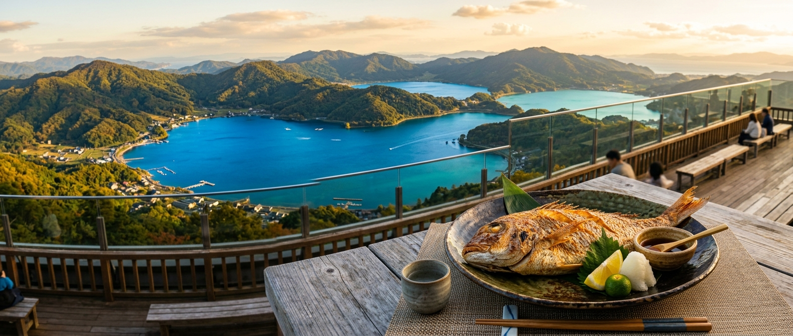

若狭湾と三方五湖が織りなす北陸の釣りエリア。大阪から北陸道経由で2時間30分〜3時間圏内にあり、若狭ぐじ（甘鯛）・天然うなぎ・レインボーラインの絶景を釣行にセットできます。ただし鉄道アクセスが複雑なため「車か電車か」の判断が重要です。

---

## このガイドが向いている人

| あなたの状況 | このガイドの使い方 |
| :--- | :--- |
| 大阪・名古屋から1泊2日で北陸釣行を計画中 | 比較表→モデルコースの順に読む |
| 若狭ぐじや天然うなぎと釣りをセットで楽しみたい | グルメ・モデルコースセクションへ |
| レインボーラインの絶景もセットにしたい | 観光セクションへ |
| 子供に食育体験（釣った魚をその場で料理）をさせたい | 施設比較のブルーパーク阿納を確認 |
| **釣り初心者で何も分からない** | **→ [初めての海上釣り堀ガイド](/tactics/beginner/first-fishing-pond)** |

---

## 若狭エリアの施設比較

| 施設 | 向いている人 | 特徴 | 子連れ | アクセス |
| :--- | :--- | :--- | :--- | :--- |
| **[フィッシングランド日向](/fishing-facility/center-japan/fukui/fishing-land-hyuga)** | 本格大物狙い・実釣優先 | 日向湖・日本海側最大級・潮通し良好・マダイ〜ブリ | ○ | 若狭上中駅から車で約15分 |
| **[ブルーパーク阿納](/fishing-facility/center-japan/fukui/blue-park-ano)** | 食育・初心者・子連れファミリー | 釣った魚をその場で調理・アットホームな民宿スタイル | ◎ | 若狭高浜ICから車で約20分 |
| **[フィッシングレインボー](/fishing-facility/center-japan/fukui/fishing-rainbow)** | 観光ついで・手軽派 | レインボーライン登り口そば・観光と一体化 | ◎ | 三方五湖PA（ETC専用）から車で約5分 |

> **迷ったら**：実釣を優先するなら**フィッシングランド日向**。子供に食育体験をさせたいなら**ブルーパーク阿納**。レインボーライン観光と組み合わせるなら**フィッシングレインボー**。

---

## アクセス概要

| 出発地 | 手段 | 所要時間 | 備考 |
| :--- | :--- | :--- | :--- |
| 大阪（梅田） | 車（北陸道 敦賀IC→小浜西IC） | 約2時間30分〜3時間 | 若狭上中IC降車が各施設に近い |
| 名古屋 | 車（名神→北陸道） | 約2時間30分 | 米原JCTで乗り継ぎ |
| 大阪 | 特急サンダーバード→小浜線 | 約2時間30分〜3時間（乗り継ぎ込み） | 大阪→敦賀 約1時間20分、敦賀→若狭上中 約40分 |

**渋滞注意**：北陸道は比較的空いているが、週末の名神（京都〜米原）は朝に混む。大阪発は5時台の出発が安全。  
**電車利用の注意**：小浜線は本数が少ない（1〜2時間に1本）。タクシーは前日予約が必須。釣具が多い場合は車が現実的。

> 詳細な北陸エリアアクセスガイドは準備中です。

---

## おすすめの1泊2日モデルプラン

| 時間 | **1日目：釣りと湖畔の恵み** | **2日目：絶景と歴史散策** |
| :--- | :--- | :--- |
| **早朝** | フィッシングランド日向で朝から大物狙い（集合7:00） | 三方五湖レインボーラインで天空の足湯 |
| **午前** | 釣り（放流タイムが最高潮） | 山頂公園から五湖を一望 |
| **昼食** | 阿納の民宿で「魚づくしランチ」 | 湖畔の老舗で「三方五湖の天然うなぎ」 |
| **午後** | 瓜割の滝でマイナスイオンを浴びる | 若狭鯖街道の宿場町「熊川宿」を散策 |
| **夕刻** | 若狭温泉の宿で「若狭ぐじ料理」 | 敦賀ICより大阪・名古屋方面へ帰路 |

**ポイント**：レインボーラインの山頂公園はリフト・ケーブルカーで移動（有料）。混雑ピークは10〜13時なので、釣り翌日は開園直後の9時前に到着するのが理想。

---

## グルメ：若狭で必ず食べたい2品

### 若狭ぐじ（甘鯛）

京料理の最高級食材として珍重される若狭の甘鯛。身が柔らかく甘みが強く、鱗をパリパリに焼き上げた「鱗焼き」は他では食べられない味。予算1人6,000〜12,000円が目安。旅館での夕食コースに組み込まれることが多く、事前予約推奨。

### 三方五湖の天然うなぎ

「口細青うなぎ」と呼ばれる三方五湖産の天然うなぎは、肉厚で脂がのりつつもしつこくない。浜松と並ぶ日本屈指のうなぎ産地で、湖畔の老舗で食べる白焼き・蒲焼は必食。

---

## 観光：若狭で外せない2か所

### 三方五湖レインボーライン山頂公園

標高約400mからの展望は「五つの湖がそれぞれ異なる青色を見せる」唯一無二の絶景。天空の足湯では湖を眺めながら旅の疲れを癒やせる。所要60〜90分。

### 熊川宿（若狭鯖街道）

若狭と京都を結んだ鯖街道の宿場町。重要伝統的建造物群保存地区に指定された古い町並みが続く。釣行2日目の帰路に30分あれば立ち寄れる。

---

## よくある質問（FAQ）

**Q1. 電車だけで若狭エリアの釣り堀に行けますか？**  
JR特急サンダーバード（大阪→敦賀）＋小浜線で若狭上中駅まで行けますが、駅からタクシーが必要で、早朝便のタクシーは台数が少ないため前日予約必須。釣具（竿ケース・クーラー）がある場合は車が現実的です。

**Q2. 大阪から日帰りは可能ですか？**  
北陸道経由で往復5〜6時間の移動になるため、釣行時間が短くなります。現実的には1泊2日の方が満足度が高い。名古屋発なら日帰りも可能。

**Q3. 若狭ぐじはどこで食べられますか？**  
若狭の旅館・料理旅館の夕食コースで食べるのが一般的。要予約（繁忙期は1ヶ月前推奨）。とれとれ市場のような気軽な施設は少ないため、宿とセットで計画するのがおすすめ。

**Q4. レンタルタックルはありますか？**  
フィッシングランド日向・ブルーパーク阿納ともにレンタルタックルあり（要確認）。ブルーパーク阿納のファミリープランは手ぶらで参加できます。

**Q5. レインボーラインと釣りは1日で両立できますか？**  
釣りが午前終了（〜12時）なら、昼食後にレインボーライン（13〜16時）が可能。2日目にまとめた方がゆとりあり。

---

## 関連ページ

- フィッシングランド日向: [/fishing-facility/center-japan/fukui/fishing-land-hyuga](/fishing-facility/center-japan/fukui/fishing-land-hyuga)
- ブルーパーク阿納: [/fishing-facility/center-japan/fukui/blue-park-ano](/fishing-facility/center-japan/fukui/blue-park-ano)
- フィッシングレインボー: [/fishing-facility/center-japan/fukui/fishing-rainbow](/fishing-facility/center-japan/fukui/fishing-rainbow)
- 初めての海上釣り堀ガイド: [/tactics/beginner/first-fishing-pond](/tactics/beginner/first-fishing-pond)
