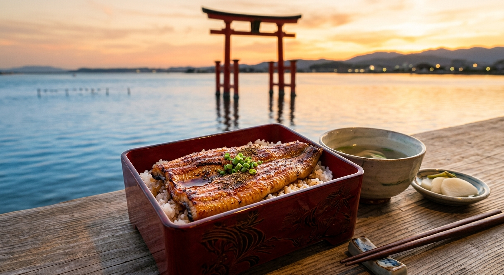

## はじめに
静岡県西部に位置する浜名湖は、海水と淡水が混ざり合う「汽水湖」として知られ、非常に多くの魚種が生息する豊かな水域です。穏やかな湖面は、小さなお子様連れのファミリーにとっても安心して釣りを楽しめる絶好のフィールド。

今回は、浜名湖周辺の釣りスポットで大物と格闘し、極上の「浜名湖うなぎ」で心もお腹も満たす、パワーチャージ1泊2日旅をご提案します。

## 海上釣り堀・海釣り公園：浜名湖の巨大魚に挑む
浜名湖周辺には、初心者や家族連れでも安心して本格的な引きを味わえるスポットが点在しています。

### 注目施設
- <strong>[新居弁天海釣公園](/fishing-facility/center-japan/shizuoka/araibenten-sea-fishing-park)</strong>: 
  浜名湖の今切口（いまぎれぐち）近くに位置し、潮通しが抜群の海釣り公園。足場が非常に良く、柵も整備されているため、小さなお子様でも安全に釣りを楽しめます。サビキ釣りでアジやサバを狙うのに最適で、週末は多くの家族連れで賑わいます。
- <strong>浜名湖フィッシングリゾート</strong>: 
  海上釣り堀スタイルで、なんと「アマゾンフィッシュ」や「イズミダイ（ティラピア）」、「うなぎ」まで釣れてしまうユニークな施設。特に夏場の「うなぎ釣り」は、子供たちに大人気のアクティビティです。
- <strong>[海上つり堀 太海（熱海方面）](/fishing-facility/center-japan/shizuoka/kaijo-tsuribori-taikoubou)</strong>: 
  （※浜名湖からは少し距離がありますが、静岡県内での本格的なイケスタイプとして有名）真鯛やブリの強烈な引きを味わいたいなら、県内の本格海上釣り堀へ足を伸ばすのも一つの選択肢です。

## ランチ：老舗で味わう『浜名湖うなぎ』
釣りの後は、伝統の味でスタミナ補給です。浜名湖周辺には、明治時代から続く老舗からモダンな専門店まで、数多くのうなぎ屋が軒を連ねています。

- <strong>関東風 vs 関西風</strong>: 
  浜松・浜名湖エリアは「蒸し」を入れる関東風と、地焼きで仕上げる関西風の両方が楽しめる珍しい地域。ふわふわの身を楽しみたいか、パリッとした香ばしさを求めるか、家族で食べ比べるのも楽しみの一つ。
- <strong>浜松餃子</strong>: 
  うなぎと並ぶ浜松のソウルフード。中心に添えられた茹でもやしが特徴で、あっさりとした味付けは釣りの後の軽いランチにもぴったりです。

## 観光：浜名湖パルパルと弁天島の絶景
釣りと食以外にも、浜名湖には魅力的なスポットが満載です。

- <strong>浜名湖パルパル</strong>: 
  小さなお子様向けの乗り物が充実している遊園地。湖畔に位置し、絶叫マシンからゆったりしたアトラクションまで揃っています。
- <strong>弁天島の鳥居</strong>: 
  湖の中にポツンと立つ赤い鳥居は、浜名湖のシンボル。特に冬場の夕暮れ時、鳥居の中に夕日が沈んでいく光景は息を呑む美しさです。

## おすすめの1泊2日モデルプラン

| 時間 | <strong>1日目：釣りと遊園地</strong> | <strong>2日目：癒やしとグルメ</strong> |
| :--- | :--- | :--- |
| <strong>AM</strong> | 新居弁天海釣公園でファミリーフィッシング | 浜名湖遊覧船で湖上散歩 |
| <strong>昼食</strong> | 浜松餃子の人気店でサクッとランチ | 創業100年の老舗で「浜名湖うなぎ」を堪能 |
| <strong>PM</strong> | 浜名湖パルパルで思い切り遊ぶ！ | ぬくもりの森でメルヘンな世界へ |
| <strong>夕刻</strong> | 舘山寺温泉の露天風呂でリラックス | 浜松駅周辺でお土産（うなぎパイ）を購入 |

## まとめ
穏やかな湖面での釣り、歴史あるうなぎ料理、そして笑顔溢れる遊園地。浜名湖での1泊2日は、家族の絆を深めるのにこれ以上ないプランです。心もお腹も満たされる、贅沢な静岡旅へ出かけてみませんか？
