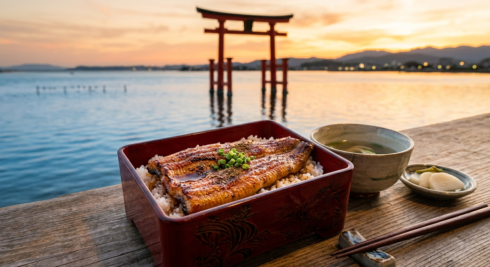

浜名湖は海水と淡水が混ざり合う汽水湖で、都市圏からのアクセスの良さとファミリー向けの充実度が際立つエリアです。「うなぎを食べながら釣りもしたい」「子供が初めてでも安心な施設を選びたい」という方向けに、施設比較と独自のモデルコースをまとめます。

移動手段（車・新幹線・渋滞情報・大型荷物の持ち込みルール）の詳細は別記事にまとめています。  
▶ **[浜名湖アクセス完全版（車・新幹線の比較）](/column/travel/access/hamanako-access-guide)**

---

## このガイドが向いている人

| あなたの状況 | このガイドの使い方 |
| :--- | :--- |
| 浜名湖に初めて家族で行く | 比較表→モデルコースの順に読む |
| うなぎグルメ×釣りを両立したい | グルメセクションとスケジュール表へ |
| 子供に安心な施設を選びたい | 比較表の「子連れ」欄で判断 |
| 観光スポットと組み合わせたい | 観光セクションへ |
| **交通手段・渋滞を調べたい** | **→ [浜名湖アクセスガイド](/column/travel/access/hamanako-access-guide)** |
| **釣り初心者で何も分からない** | **→ [初めての海上釣り堀ガイド](/tactics/beginner/first-fishing-pond)** |

---

## 浜名湖の施設比較：あなたに向いているのはどこ？

浜名湖エリアは「汽水湖ならでは」の珍しい体験ができる施設が特徴です。

| 施設 | タイプ | 向いている人 | 魚種の特徴 | 子連れ | アクセス |
| :--- | :--- | :--- | :--- | :--- | :--- |
| **[新居弁天海釣公園](/fishing-facility/center-japan/shizuoka/araibenten-sea-fishing-park)** | 海釣り公園 | ファミリー・初心者・サビキ派 | アジ・サバ・サッパ | ◎（柵・足場完備） | 弁天島駅から徒歩圏内 |
| **浜名湖フィッシングリゾート** | イケス釣り | うなぎ釣り体験・珍しい体験重視 | うなぎ・アマゾンフィッシュ・ティラピア | ○ | 舞阪駅からタクシー約5分 |
| **[海上つり堀 太海](/fishing-facility/center-japan/shizuoka/kaijo-tsuribori-taikoubou)** | 本格海上釣り堀 | 大物・マダイ・ブリを本気で狙う | 真鯛・ブリ（強引き） | △ | 車推奨 |

> **迷ったら**：初めてのファミリーなら**新居弁天海釣公園**（徒歩圏・柵完備・無料エリアあり）。子供に強烈な体験をさせるなら**浜名湖フィッシングリゾートのうなぎ釣り**。本格大物狙いなら**海上つり堀 太海**。

---

## おすすめの1泊2日モデルプラン

浜名湖エリアは「釣り＋うなぎ＋温泉」が最高の組み合わせです。渋滞対策として2日目の午後に浜松市内でうなぎを食べてから帰るのが定番です。

| 時間 | **1日目：釣りと遊園地** | **2日目：湖上と名物グルメ** |
| :--- | :--- | :--- |
| **早朝** | 新居弁天海釣公園または施設で受付 | 弁天島の鳥居で朝の散歩 |
| **午前** | 釣り（サビキ or イケス） | 浜名湖遊覧船で湖上散歩 |
| **昼食** | 浜松餃子の人気店でサクッとランチ | 創業100年の老舗で**浜名湖うなぎ**を堪能 |
| **午後** | 浜名湖パルパルで思い切り遊ぶ | ぬくもりの森でメルヘンな雰囲気へ |
| **夕刻** | 舘山寺温泉の露天風呂でリラックス | 浜松駅でお土産（うなぎパイ）→帰路 |

**ポイント**：東京発の場合、帰路の東名上り渋滞（15〜20時）が最大の懸念。うなぎを食べながら19時以降に出発すると渋滞がほぼ解消します。詳細は▶ [浜名湖アクセスガイド](/column/travel/access/hamanako-access-guide)

---

## 浜名湖ならではの独自価値：うなぎ釣り体験

浜名湖フィッシングリゾートでは夏季を中心に「うなぎ釣り」ができます。子供たちがうなぎを自分で釣り、そのまま食べるという体験は他のエリアではほぼできません。

**注意点**：うなぎ釣りは季節・天候によって実施状況が変わります。公式サイトまたは電話で事前確認してから行くことを強くおすすめします。

---

## グルメ：浜名湖で必ず食べたい3品

### 浜名湖うなぎ（関東風 vs 関西風の食べ比べ）

浜松・浜名湖エリアは蒸しを入れる関東風と地焼きの関西風の両方が揃う珍しい地域。同じ食材でも食感が全く異なります。ふわふわか香ばしいパリパリか、家族で食べ比べる価値あり。相場は1,500〜3,000円台（うな重）。

### 浜松餃子

中央に茹でもやしを添えるのが浜松スタイル。あっさりした味付けは釣りの後の軽い食事にもぴったり。1人前500〜700円台で食べられる店が多い。

### 弁天島の朝の鳥居と水辺の朝食

湖中に立つ赤い鳥居は冬の夕暮れ時が絶景ですが、早朝の静寂な時間帯も別の美しさがあります。近くのカフェやパン屋で朝食を取るのが地元民の週末スタイル。

---

## 観光：浜名湖パルパルと弁天島

### 浜名湖パルパル

子供向けの乗り物が充実した遊園地。釣りに飽きた小さな子供を連れてきても1日楽しめます。絶叫系からゆったり系まで揃い、湖畔のロケーションが気持ちいい。

### 弁天島の鳥居

湖上にポツンと立つ赤い鳥居は浜名湖のシンボル。冬の夕暮れ時に鳥居の中に夕日が沈む光景は息を呑む美しさです。駐車場（有料）が近くにあり、車でも訪れやすい。

---

## よくある質問（FAQ）

**Q1. 新幹線だけで施設まで行けますか？**  
浜松駅→在来線で舞阪・弁天島まで約10分。新居弁天海釣公園は弁天島駅から徒歩圏内で電車でもアクセス可能です。ただし早朝のタクシーは前日予約が必要。詳細は▶ [浜名湖アクセスガイド](/column/travel/access/hamanako-access-guide)

**Q2. うなぎ釣りはいつでもできますか？**  
主に夏季（6〜9月）の実施が多いです。施設に直接確認してください。

**Q3. 子供の釣り初体験に最適な施設は？**  
新居弁天海釣公園は柵と足場がしっかりしており、サビキ釣りで小魚が釣れるため、初めての子供でも達成感を得やすいです。

**Q4. 東京から日帰りは可能ですか？**  
可能ですが、東名の渋滞を考えると往復がかなりタイト。新幹線こだまを活用するか、1泊をおすすめします。費用・時間の詳細は▶ [浜名湖アクセスガイド](/column/travel/access/hamanako-access-guide)

**Q5. レンタルタックルはありますか？**  
新居弁天海釣公園・浜名湖フィッシングリゾートともにレンタル対応あり（要事前確認）。

---

## 関連ページ

- **[東海アクセスガイド（三重・浜名湖・愛知の広域比較）](/column/travel/access/access-tokai)**
- **[浜名湖アクセス完全版（車・新幹線の比較）](/column/travel/access/hamanako-access-guide)**
- 新居弁天海釣公園: [/fishing-facility/center-japan/shizuoka/araibenten-sea-fishing-park](/fishing-facility/center-japan/shizuoka/araibenten-sea-fishing-park)
- 海上つり堀 太海: [/fishing-facility/center-japan/shizuoka/kaijo-tsuribori-taikoubou](/fishing-facility/center-japan/shizuoka/kaijo-tsuribori-taikoubou)
- 初めての海上釣り堀ガイド: [/tactics/beginner/first-fishing-pond](/tactics/beginner/first-fishing-pond)
