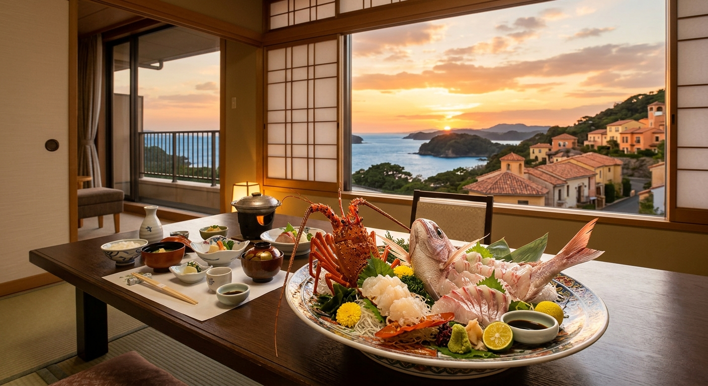

## はじめに
三重県、伊勢志摩エリアは「海上釣り堀の聖地」とも呼ばれるほど多くの施設が点在し、まさに釣り人の天国です。リアス式海岸が生み出す穏やかな波と、豊かな黒潮の恩恵を受けた海の幸。そこに日本人の心のふるさと「伊勢神宮」での参拝を組み合わせれば、これ以上ない贅沢な釣行旅行が完成します。

今回は、パパも納得の釣果と、ママも喜ぶ美食・観光を両立させた「伊勢志摩1泊2日完全モデルプラン」をご紹介します。

## 1日目：海上釣り堀で大物と格闘！
伊勢志摩エリアの海上釣り堀は、規模が大きく魚種も豊富なのが特徴。多くの施設が午前中に放流タイムを設けているため、早朝からのスタートが基本です。

### 注目施設
- <strong>[伝八屋（でんぱちや）](/fishing-facility/west-japan/mie/tsuribori-denpachiya)</strong>: 
  伊勢志摩を代表する老舗の海上釣り堀。筏（いかだ）まで船で渡るワクワク感は格別。放流される真鯛やワラサの活性が高く、ベテランから初心者まで爆釣の期待がかかります。
- <strong>[正徳丸（しょうとくまる）](/fishing-facility/west-japan/mie/tsuribori-shotokumaru)</strong>: 
  紀北町の豊かな海に設置された大型釣り堀。足場が安定しており、スタッフのサポートも手厚いため、家族連れでも安心して本格的な引きを楽しめます。
- <strong>[フィッシングパーク・トリトン](/fishing-facility/west-japan/mie/fishing-park-triton)</strong>: 
  鳥羽市にある、リゾート感溢れる施設。釣り堀だけでなく、BBQコーナーが併設されているため、釣ったばかりの魚をその場で焼いて食べる「最高の贅沢」が味わえます。

## グルメ：伊勢海老・あわび・てこね寿司
釣りの後は、伊勢志摩が誇る豪華食材を堪能しましょう。

- <strong>伊勢海老・あわび</strong>: 
  鳥羽や志摩の海女小屋では、ベテラン海女さんが目の前で豪華食材を焼いてくれる「海女小屋体験」が大人気。炭火で焼いた磯の香りは、まさに至福のひととき。
- <strong>てこね寿司</strong>: 
  志摩地方の漁師料理。カツオやマグロを甘辛い醤油ダレに漬け込み、酢飯と合わせた一品。釣りの合間のランチにも最適です。
- <strong>伊勢うどん</strong>: 
  太くて柔らかい麺に、真っ黒な濃厚ダレ。見た目ほど辛くなく、モチモチした食感は子供も大好きな味です。

## 2日目：伊勢神宮参拝とおかげ横丁
2日目は、朝の透明な空気の中で伊勢神宮を参拝しましょう。

- <strong>外宮・内宮参拝</strong>: 
  まずは外宮、次に内宮を巡るのが正式な順序。内宮近くにある「五十鈴川」の御手洗場で手を清めると、心まで洗われるような感覚になります。
- <strong>おかげ横丁散策</strong>: 
  参拝後は、江戸時代の街並みを再現した「おかげ横丁」へ。「赤福餅」をその場で頂ける赤福本店や、お土産探しにぴったりの雑貨店が軒を連ねます。

## おすすめの1泊2日モデルコース

| 時間 | <strong>1日目：大物釣り！</strong> | <strong>2日目：お伊勢参り</strong> |
| :--- | :--- | :--- |
| <strong>AM</strong> | 伝八屋でモーニング爆釣タイム！ | 伊勢神宮（外宮・内宮）をゆっくり参拝 |
| <strong>昼食</strong> | 海女小屋で「豪華磯焼き」を楽しむ | おかげ横丁で「伊勢うどん」と「メンチカツ」 |
| <strong>PM</strong> | 志摩の展望台でリアス式海岸を一望 | おはらい町で食べ歩き＆お土産探し |
| <strong>夕刻</strong> | 賢島の温泉宿で釣った魚を懐石料理に | 伊勢ICより帰路へ |

## まとめ
伊勢志摩は、釣果も思い出も「大漁」間違いなしのエリアです。荒波に揉まれた力強い魚たちとの格闘、そして歴史の深さに触れる参拝道。次の週末、大切な家族と一緒に、この特別な体験を共有してみませんか？
