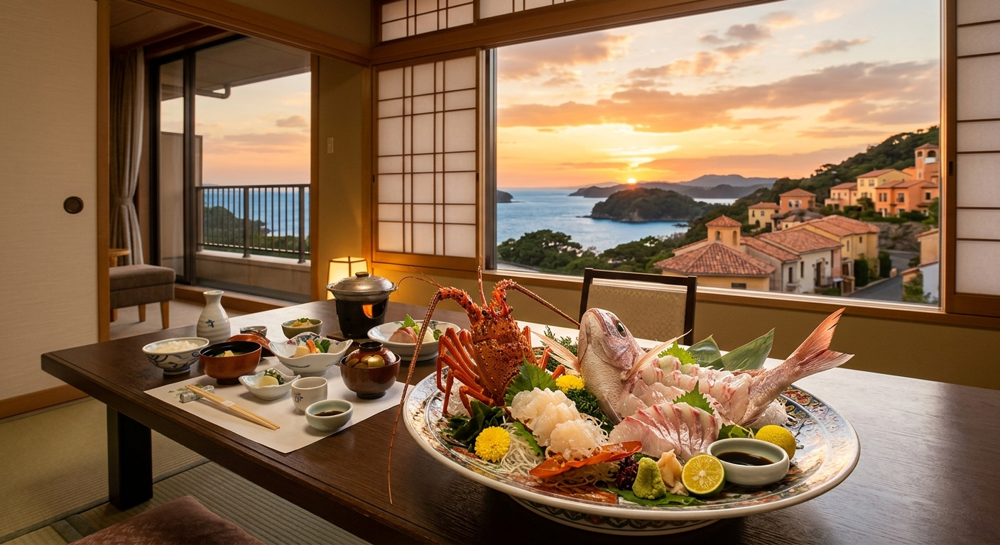

伊勢志摩には主要施設だけで10件以上の海上釣り堀が集まっています。「どこを選べばいいか分からない」という声が多いため、まず**施設の比較表**と**あなたに向いているかの判断基準**を冒頭に置きます。

移動手段（車・電車・飛行機・渋滞・釣具の持ち込み）の詳細は別記事にまとめています。  
▶ **[伊勢志摩アクセス完全版（車・電車・飛行機の比較）](/column/travel/access/ise-shima-access-guide)**

---

## このガイドが向いている人

| あなたの状況 | このガイドの使い方 |
| :--- | :--- |
| 伊勢志摩に初めて行く | 比較表→モデルコースの順に読む |
| 観光・グルメとセットで楽しみたい | スケジュール表と観光セクションへ |
| 施設を比較して選びたい | 次の「施設比較表」へ |
| 子連れで行きたい | 比較表の「子連れ ○」施設を選ぶ |
| **交通手段・アクセスを調べたい** | **→ [伊勢志摩アクセスガイド](/column/travel/access/ise-shima-access-guide)** |
| **釣り初心者で何も分からない** | **→ [初めての海上釣り堀ガイド](/tactics/beginner/first-fishing-pond)** |

---

## 伊勢志摩の施設比較：あなたに向いているのはどこ？

公式サイトには載っていない「選ぶ理由・やめる理由」を整理しました。

| 施設 | エリア | 向いている人 | 魚種の特徴 | アクセス難易度 | 子連れ | 観光との相性 |
| :--- | :--- | :--- | :--- | :--- | :--- | :--- |
| **[辨屋](/fishing-facility/west-japan/mie/kaijo-tsuribori-benya)** | 南伊勢・礫浦 | ベテラン・本気の釣行 | 放流量多・青物 | 玉城ICから50分（やや遠） | △ | △ |
| **[佐助屋](/fishing-facility/west-japan/mie/fishing-park-sasukeya)** | 南伊勢 | 初心者・家族 | 真鯛中心・安定 | 玉城ICから35分 | ○ | △ |
| **[正徳丸](/fishing-facility/west-japan/mie/tsuribori-shotokumaru)** | 紀北・紀伊長島 | 初心者〜中級・電車利用者 | クエ・高級魚 | 紀伊長島ICから**7分**（最短） | ○ | ○（熊野古道） |
| **[トリトン](/fishing-facility/west-japan/mie/fishing-park-triton)** | 鳥羽 | 観光重視・カップル | 真鯛・青物・BBQ | 鳥羽駅から15分（電車可） | ○ | ◎（神宮・水族館） |
| **[伝八屋](/fishing-facility/west-japan/mie/tsuribori-denpachiya)** | 南伊勢 | 筏体験・中級者 | 真鯛・ワラサ・老舗の安定感 | 玉城ICから40分 | △ | △ |

> **迷ったら**：初めてなら**正徳丸**（アクセス最良・設備充実）か**トリトン**（観光との組み合わせ◎）。釣果を本気で求めるなら**辨屋**。

---

## おすすめの1泊2日モデルコース

伊勢志摩は「釣り＋伊勢神宮参拝」が最も人気の組み合わせです。1日目に釣行、2日目に観光を入れると渋滞も分散できます。

| 時間 | **1日目：釣行** | **2日目：伊勢神宮＆観光** |
| :--- | :--- | :--- |
| **早朝** | 選んだ施設で集合（6:00〜7:00） | 伊勢神宮・外宮参拝 |
| **午前** | 釣り（午前放流タイムが最高潮） | 伊勢神宮・内宮参拝、五十鈴川で手を清める |
| **昼食** | 海女小屋で豪華磯焼き、またはBBQ（トリトン） | おかげ横丁で伊勢うどん・赤福 |
| **午後** | 施設終了後、鳥羽・志摩の温泉宿へ | おはらい町で食べ歩き・土産 |
| **夕刻** | 宿で釣果を懐石料理・お刺身で | 伊勢ICより帰路へ |

**宿の選び方**：鳥羽・賢島エリアに高級旅館が集中。予算を抑えるなら伊勢市内のビジネスホテル（内宮まで車10分）も実用的です。

---

## グルメ：伊勢志摩で必ず食べたい3品

### 海女小屋体験（伊勢海老・あわび）

鳥羽・志摩エリアの海女小屋では、伊勢海老やあわびを炭火で焼いてくれる体験が大人気です。夏〜秋シーズンは予約必須。価格は海産物次第（伊勢海老は時価）で変動します。

### てこね寿司

志摩地方の漁師飯。カツオまたはマグロを甘辛い醤油ダレに漬け、酢飯と合わせた丼スタイル。釣り後のランチに最適で、1,000〜1,500円台が相場です。

### 伊勢うどん

太くて柔らかい麺に濃厚な黒タレ。見た目より辛くなく、子供も食べやすい。おかげ横丁に複数の名店があります。

---

## 伊勢神宮参拝：釣りと組み合わせるコツ

- **外宮→内宮の順**が正式。外宮は所要30分、内宮は1時間以上みておくと余裕あり
- **五十鈴川の御手洗場**：内宮近く。手を清める場所として有名で、空気が変わる体験ができます
- **おかげ横丁**：参拝後の食事・土産に最適。混雑は昼ピーク。朝8〜9時の外宮参拝後に内宮へ向かうと比較的空いています
- **車の場合**：内宮の駐車場は混雑しやすい。B4・B5駐車場（有料）を使うか、おはらい町付近の民間駐車場を利用

---

## よくある質問（FAQ）

**Q1. 電車だけで施設まで行けますか？**  
最寄り駅から施設まで徒歩圏外の施設がほとんどです。駅レンタカーまたはタクシーが必要です。詳細は▶ [伊勢志摩アクセスガイド](/column/travel/access/ise-shima-access-guide)

**Q2. 子供連れで楽しめる施設はどこですか？**  
トリトン・正徳丸・佐助屋はスタッフのサポートが手厚く、設備も整っています。上の比較表で「子連れ ○」の施設を参照してください。

**Q3. 大阪・名古屋から日帰りは可能ですか？**  
可能ですが、集合時間が早朝6〜7時の施設が多いため、大阪発は3〜4時台、名古屋発は4〜5時台の出発が現実的です。渋滞の読み方も含め▶ [アクセスガイド](/column/travel/access/ise-shima-access-guide) で詳しく解説しています。

**Q4. 釣り道具を持っていなくても大丈夫ですか？**  
竿・仕掛けのレンタルに対応している施設がほとんどです。各施設記事の「基本情報」欄を確認してください。

**Q5. 海上釣り堀って初心者でも釣れますか？**  
放流魚が高密度のため、ほぼ全員が1匹以上釣れます。当日の流れや持ち物は▶ [初めての海上釣り堀ガイド](/tactics/beginner/first-fishing-pond) で詳しく解説しています。

---

## 関連ページ

- **[東海アクセスガイド（三重・浜名湖・愛知の広域比較）](/column/travel/access/access-tokai)**
- **[伊勢志摩アクセス完全版（車・電車・飛行機の比較）](/column/travel/access/ise-shima-access-guide)**
- 海上釣り堀 辨屋: [/fishing-facility/west-japan/mie/kaijo-tsuribori-benya](/fishing-facility/west-japan/mie/kaijo-tsuribori-benya)
- 釣り公園 佐助屋: [/fishing-facility/west-japan/mie/fishing-park-sasukeya](/fishing-facility/west-japan/mie/fishing-park-sasukeya)
- 海上釣り堀 正徳丸: [/fishing-facility/west-japan/mie/tsuribori-shotokumaru](/fishing-facility/west-japan/mie/tsuribori-shotokumaru)
- フィッシングパーク・トリトン: [/fishing-facility/west-japan/mie/fishing-park-triton](/fishing-facility/west-japan/mie/fishing-park-triton)
- 海上釣り堀 伝八屋: [/fishing-facility/west-japan/mie/tsuribori-denpachiya](/fishing-facility/west-japan/mie/tsuribori-denpachiya)
- 初めての海上釣り堀ガイド: [/tactics/beginner/first-fishing-pond](/tactics/beginner/first-fishing-pond)
