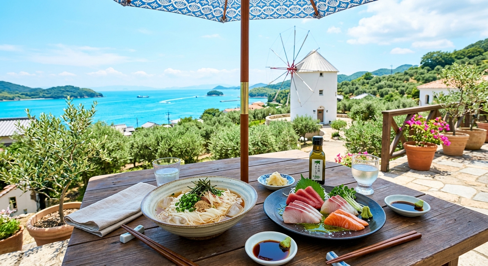

## はじめに
香川県、小豆島。「二十四の瞳」の舞台や、日本屈指のオリーブの産地として知られるこの島は、穏やかな瀬戸内海に包まれています。フェリーから降り立った瞬間に感じる潮風と、どこか懐かしい風景。時計の針を少し戻したような、のんびりとした島時間を釣りと共に過ごしてみませんか？

今回は、瀬戸内の海の幸と、離島ならではのアクティビティを詰め込んだ「小豆島1泊2日癒やしの釣行旅」をご提案します。

## 海上釣り堀・海釣り体験：離島のプライベート感
小豆島とその周辺には、瀬戸内海の穏やかな海面を活かした、初心者や家族連れに最適な釣りスポットが点在しています。

### 注目施設
- <strong>[小豆島ふるさと村 釣り桟橋](/fishing-facility/west-japan/kagawa/shodoshima-furusatomura-fishing-pier)</strong>: 
  「道の駅 小豆島ふるさと村」に併設された釣り桟橋。安全な柵が設けられており、手ぶらでサビキ釣りを楽しめます。マダイやアジ、サヨリなど、季節に応じた瀬戸内の魚が狙え、お子様の釣りデビューにぴったりの場所です。
- <strong>[ソルトレイクひけた（安戸池）](/fishing-facility/west-japan/kagawa/saltlake-hiketa-adoike)</strong>: 
  小豆島からフェリーで渡った対岸（東香川市）にある、日本初のハマチ養殖発祥の地。広大な池（海水）にマダイやハマチ、ブリが放流されており、強烈な引きを味わいたい本格派の方に非常におすすめです。
- <strong>[直島つり公園](/fishing-facility/west-japan/kagawa/naoshima-fishing-park)</strong>: 
  アートの島として有名な直島にある海釣り公園。小豆島から島を巡る「アイランドホッピング」の途中に立ち寄るのも一案です。

## グルメ：小豆島そうめんとオリーブハマチ
小豆島の食文化は、豊かな自然と伝統が融合しています。

- <strong>手延べそうめん</strong>: 
  400年以上の歴史を誇る小豆島そうめん。ごま油を使って延ばされた麺は、驚くほど強いコシとツルッとした喉越しが特徴。暑い中での釣りの後に食べるそうめんは格別の美味しさです。
- <strong>オリーブ牛 / オリーブハマチ</strong>: 
  オリーブの果実を配合した飼料で育った「オリーブ牛」や「オリーブハマチ」。脂がしつこくなく、さっぱりとした旨みは小豆島ならではのブランド食材です。特に旬のオリーブハマチの刺身は絶品！
- <strong>生醤油・オリーブオイル</strong>: 
  島内には醤油蔵（醤の郷）が点在。新鮮な刺身に、地元の生醤油とオリーブオイルを数滴垂らして頂くのが通の食べ方。

## 観光：エンジェルロードとオリーブ公園
釣りの後は、島を代表する絶景スポットへ足を運びましょう。

- <strong>エンジェルロード（天使の散歩道）</strong>: 
  1日2回の干潮時にだけ現れる砂の道。大切な人と手を繋いで渡ると願いが叶うと言われています。ドラマや映画のロケ地としても有名です。
- <strong>小豆島オリーブ公園</strong>: 
  真っ白なギリシャ風車が回る広大な公園。魔法のほうき（無料貸出）で空を飛ぶポーズをして撮影するのが、島を訪れる旅行者の定番です。

## おすすめの1泊2日モデルプラン

| 時間 | <strong>1日目：島釣りとのんびり観光</strong> | <strong>2日目：絶景と伝統に触れる</strong> |
| :--- | :--- | :--- |
| <strong>AM</strong> | 小豆島ふるさと村で親子フィッシング | エンジェルロードで朝の散策 |
| <strong>昼食</strong> | 島の食堂で「小豆島そうめん」ランチ | 「醤の郷」で醤油蔵巡りと醤油ソフト |
| <strong>PM</strong> | オリーブ公園でフォトジェニックなひととき | 二十四の瞳映画村で昭和レトロ体験 |
| <strong>夕刻</strong> | 小豆島温泉で夕日を眺めながら入浴 | 坂手港または土庄港よりフェリーで帰路へ |

## まとめ
フェリーで渡るというプロセスそのものが、日常を忘れさせてくれる小豆島の旅。穏やかな海での釣果と、心震える絶景、そして歴史ある特産品。次の連休、日常の喧騒を離れて、オリーブの島で最高の「リラックス釣行」を体験してみませんか？
