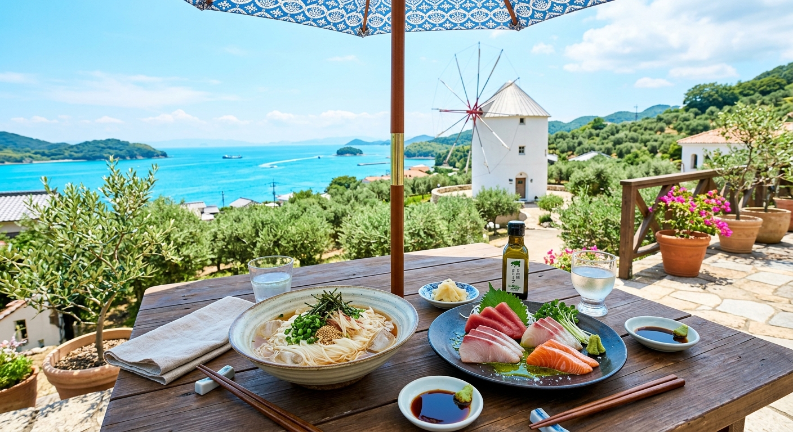

---
title: "【香川・小豆島】施設の選び方からフェリー・オリーブグルメ・エンジェルロードまで完全ガイド"
publishDate: 2026-03-21
updatedDate: 2026-07-08
draft: false
category: "釣り旅ガイド"
prefecture: "kagawa"
region: "west-japan"
slug: "kagawa-shodoshima-trip"
image: ./cover.jpg
tags:
  - "コラム"
  - "旅行"
  - "香川県"
  - "小豆島"
  - "オリーブ"
description: "香川・小豆島の釣り施設を比較し、フェリー×オリーブグルメ×エンジェルロードを組み合わせた1泊2日モデルコースを解説。高松港から土庄港へ四国フェリー60分・高速船35分。車の積載可否と島内移動手段も整理。"
---

瀬戸内海に浮かぶ小豆島。フェリーで渡る離島釣行は「移動そのものが旅」です。ただしフェリーの車積載可否・島内移動手段・施設予約タイミングが本土と大きく異なるため、事前の計画が特に重要になります。

---

## このガイドが向いている人

| あなたの状況 | このガイドの使い方 |
| :--- | :--- |
| 小豆島に初めて行く家族・カップル | 比較表→フェリーセクション→モデルコースの順に読む |
| オリーブグルメとそうめんと釣りをセットにしたい | グルメ・モデルコースセクションへ |
| 離島らしいのんびりした釣り体験がしたい | 施設比較とFAQへ |
| <strong>車ごとフェリーに乗れるか知りたい</strong> | <strong>フェリーアクセスセクションへ</strong> |
| <strong>釣り初心者で何も分からない</strong> | <strong>→ [初めての海上釣り堀ガイド](/tactics/beginner/first-fishing-pond)</strong> |

---

## 小豆島エリアの施設比較

| 施設 | 向いている人 | 特徴 | 子連れ | アクセス |
| :--- | :--- | :--- | :--- | :--- |
| <strong>[小豆島ふるさと村 釣り桟橋](/fishing-facility/shodoshima-furusatomura-fishing-pier/)</strong> | 子連れ初心者・手ぶら体験派 | 道の駅併設・柵あり・サビキ釣りOK・マダイ・アジ | ◎ | 池田港から車で約5分 |
| <strong>[ソルトレイクひけた（安戸池）](/fishing-facility/saltlake-hiketa-adoike/)</strong> | 本格大物派・ハマチ・ブリ狙い | 日本初ハマチ養殖発祥地・広大な海水池 | ○ | 本土側・引田駅から車で約10分 |
| <strong>[直島つり公園](/fishing-facility/naoshima-fishing-park/)</strong> | アート×釣りの掛け合わせ派 | 直島・アートの島・アイランドホッピングの途中に | ○ | 直島宮浦港から徒歩圏 |

> <strong>迷ったら</strong>：小豆島メインのファミリー釣行は<strong>小豆島ふるさと村</strong>。本格的な大物狙いなら小豆島から日帰りで行ける本土側の<strong>ソルトレイクひけた</strong>も組み合わせ可。

---

## フェリーアクセス

小豆島へは複数の港から複数の航路があります。目的に合わせて選択してください。

| 出発港 | 到着港 | 船種 | 所要時間 | 料金目安 | 車積載 |
| :--- | :--- | :--- | :--- | :--- | :--- |
| 高松港 | 土庄港 | フェリー（四国フェリー） | 約60分 | 大人690円 | ○（要予約） |
| 高松港 | 土庄港 | 高速船（雌雄島海運） | 約35分 | 大人1,170円 | × |
| 新岡山港 | 土庄港 | フェリー（両備フェリー） | 約70分 | 大人1,220円 | ○ |
| 神戸港（六甲アイランド） | 坂手港 | フェリー（ジャンボフェリー） | 約3時間20分 | 大人1,990円 | ○ |

<strong>車積載の注意</strong>：フェリーの車積載は繁忙期（GW・お盆・紅葉シーズン）に満車になることがあります。繁忙期は必ず事前予約を。  
<strong>釣具持参の場合</strong>：竿ケースはフェリーの手回り品として持ち込み可能（大型の場合は要確認）。高速船は大型荷物NG。

> 詳細な四国・瀬戸内エリアアクセスガイドは準備中です。

---

## おすすめの1泊2日モデルプラン

| 時間 | <strong>1日目：島釣りとのんびり観光</strong> | <strong>2日目：絶景と伝統文化</strong> |
| :--- | :--- | :--- |
| <strong>早朝</strong> | 小豆島ふるさと村で親子フィッシング | エンジェルロードで朝の干潮散策 |
| <strong>午前</strong> | 釣り体験（アジ・マダイ・サヨリ） | 醤の郷で醤油蔵巡り |
| <strong>昼食</strong> | 島の食堂で「小豆島そうめん」 | 地元食堂で「オリーブハマチの刺身定食」 |
| <strong>午後</strong> | オリーブ公園でフォトタイム | 二十四の瞳映画村でレトロ体験 |
| <strong>夕刻</strong> | 小豆島温泉で夕日を見ながら入浴 | 土庄港 or 坂手港よりフェリーで帰路 |

<strong>ポイント</strong>：エンジェルロードは1日2回の干潮時のみ現れる砂の道。事前に潮汐表を確認して訪問時間を合わせると確実に渡れる。

---

## グルメ：小豆島で必ず食べたい2品

### 手延べそうめん

400年以上の歴史を誇る小豆島そうめん。ごま油を使って延ばされた麺はコシが強く喉越しが良い。島内の直売所や食堂で食べられ、産地価格でお土産にも最適。

### オリーブハマチ・オリーブ牛

オリーブの果実を配合した飼料で育てた「オリーブハマチ」と「オリーブ牛」は小豆島のブランド食材。オリーブ由来の脂がさっぱりしていて食べやすく、刺身・焼きともに絶品。

---

## 観光：小豆島で外せない2か所

### エンジェルロード（天使の散歩道）

1日2回の干潮時にだけ現れる砂の道。大切な人と手を繋いで渡ると願いが叶うという伝説がある。ドラマ・映画のロケ地としても有名で所要15〜30分。

### 小豆島オリーブ公園

ギリシャ風車が回る広大な白い公園。地中海を思わせる景観で、映画「魔女の宅急便」のロケ地としても知られる。入場無料。所要30〜60分。

---

## 小豆島の宿泊先選び

離島釣行はフェリーの時間に縛られるため、宿の立地選びが翌日の動きやすさを決めます。

- <strong>港・施設まで車で30分以内</strong>：土庄港・池田港からの移動時間を基準に選ぶ
- <strong>素泊まりプランで十分</strong>：早朝の釣り体験に合わせて出発する場合、朝食付きは使い切れないことも
- <strong>フェリーの始発時刻と宿の朝食提供時間</strong>を照らし合わせておく（帰りの便に合わせて逆算）

| 宿泊エリア | 特徴 | 向いている人 |
| :--- | :--- | :--- |
| <strong>土庄港周辺</strong> | フェリーターミナルに近く、翌朝の移動がスムーズ | 公共交通・フェリー移動中心の人 |
| <strong>小豆島温泉郷（島内各所）</strong> | 夕日を見ながら入浴できる宿が点在 | 温泉と離島の雰囲気を両方楽しみたい人 |

---

## よくある質問（FAQ）

<strong>Q1. 車ごとフェリーに乗れますか？</strong>  
高松港・新岡山港・神戸港発のフェリーで車積載可能。繁忙期（GW・お盆）は早めに予約が必要。高速船（高松→土庄 35分）は車不可。

<strong>Q2. 釣具（竿・クーラー）はフェリーに持ち込めますか？</strong>  
フェリーは手回り品として基本的に持ち込み可能ですが、大型クーラーは別途確認を。高速船への大型荷物持ち込みは不可の場合があります。

<strong>Q3. 小豆島1日で観光も釣りも両立できますか？</strong>  
可能ですが、ふるさと村の釣り体験（午前）＋オリーブ公園（午後）でほぼ埋まります。1泊2日の方が島をより深く楽しめます。

<strong>Q4. 島内でレンタカーは借りられますか？</strong>  
土庄港・池田港周辺にレンタカー営業所があります。フェリーで渡ってからレンタカーを借りることも可能。

<strong>Q5. ソルトレイクひけたは小豆島から行けますか？</strong>  
ソルトレイクひけた（安戸池）は本土側・東香川市にあります。小豆島から高松港でフェリーを降りた後、JR引田駅方面に車で30〜40分。小豆島とは別日に計画するのが現実的です。

---

## 関連ページ

- 小豆島ふるさと村 釣り桟橋: [/fishing-facility/shodoshima-furusatomura-fishing-pier/](/fishing-facility/shodoshima-furusatomura-fishing-pier/)
- ソルトレイクひけた（安戸池）: [/fishing-facility/saltlake-hiketa-adoike/](/fishing-facility/saltlake-hiketa-adoike/)
- 直島つり公園: [/fishing-facility/naoshima-fishing-park/](/fishing-facility/naoshima-fishing-park/)
- 初めての海上釣り堀ガイド: [/tactics/beginner/first-fishing-pond](/tactics/beginner/first-fishing-pond)
- <strong>[瀬戸内アクセスガイド](/column/travel/access/setouchi-access-guide)</strong>——東京・大阪・名古屋・福岡から香川への行き方
- <strong>[遠征釣行ガイド（全国版）](/column/travel/access/ensei-guide)</strong>——移動費・釣具配送・前泊のノウハウまとめ
