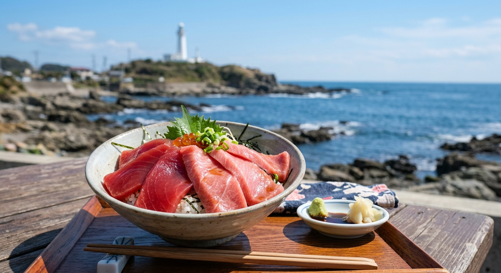

## はじめに
神奈川県、三浦半島。都心から1時間前後という驚異的な近さにありながら、そこには本格的な「海のレジャー」が待ち受けています。京急電鉄の「みさきまぐろきっぷ」でも有名なこのエリアは、実は関東で海上釣り堀を体験するなら外せない重要な拠点でもあります。

「今度の休み、遠出はできないけれど本格的な釣りがしたい…」そんなパパの願いを叶える、三浦半島の釣り×グルメ日帰り満喫プランをご提案します。

## 海上釣り堀：都心近くの本格派「イケス」
三浦半島の先端には、周囲の豊かな海域を活かした、関東でも指折りの人気を誇る釣り堀があります。

### 注目施設
- <strong>[みうら海王](/fishing-facility/east-japan/kanagawa/miura-kaiou)</strong>: 
  三浦市三崎にある、関東最大級の海上釣り堀。とにかく巨大なイケスには、マダイやワラサ、さらには高級魚のヒラメやシマアジまで、驚くほど多くの魚が放流されています。スタッフが常駐し、タナ取りからアワセのコツまで教えてくれるため、初心者でも「手ぶらで本格爆釣」が叶います。
- <strong>[城ヶ島海上釣り堀（J'sフィッシング）](/fishing-facility/east-japan/kanagawa/jogashima-js-fishing)</strong>: 
  三浦半島の最南端、城ヶ島にある施設。城ヶ島大橋を渡った先にあるこのスポットは、開放感あふれるロケーションが魅力。マダイの引きを楽しみながら、目の前に広がる相模湾の絶景を堪能できる、贅沢な釣り堀体験が可能です。

## グルメ：三崎といえば「マグロ」と「三浦野菜」
三浦を訪れたなら、これを食べずに帰るわけにはいきません。

- <strong>三崎マグロ</strong>: 
  全国有数のマグロ水揚げ量を誇る三崎港。口の中でとろける「中トロ」や、希少な「カマ焼き」、マグロのホルモン料理など、専門店ならではのバリエーション豊かな味が楽しめます。
- <strong>三浦野菜（三浦大根・地場キャベツ）</strong>: 
  潮風を浴びて育った三浦の野菜は、甘みが強く非常に高品質。地元のマルシェや「うらりマルシェ」で、スーパーではなかなかお目にかかれない新鮮な野菜をお土産に買い込むのも三浦旅の定番です。
- <strong>海見えテラスのカフェ</strong>: 
  秋谷や三浦海岸沿いには、湘南エリアに負けないお洒落なカフェが充実。海を眺めながらのパンケーキやコーヒーは、パパの釣りを待つママや子供たちにも大好評。

## 観光：城ヶ島ハイキングとソレイユの丘
釣りの後は、三浦半島の自然と触れ合いましょう。

- <strong>城ヶ島（じょうがしま）公園</strong>: 
  島全体が公園のようになっており、奇岩が並ぶ海岸線を歩くハイキングコースは絶景です。「馬の背洞門」と呼ばれる自然のアーチは、三浦を象徴するフォトスポット。
- <strong>長井海の手公園（ソレイユの丘）</strong>: 
  2023年にリニューアルされた、超巨大な体験型パーク。ゴーカートやアスレチック、動物とのふれあい、キャンプ場まで完備されており、ファミリーでの1泊旅行にも最適です。

## おすすめの日帰りモデルコース（京急線活用もOK）

| 時間 | <strong>AM：都心出発・三浦着</strong> | <strong>PM：釣りと三崎満喫</strong> |
| :--- | :--- | :--- |
| <strong>08:00</strong> | 品川・横浜より三浦方面へ（京急快特） | 城ヶ島公園で絶景ハイキング |
| <strong>09:30</strong> | みうら海王またはJ'sフィッシング到着 | 三崎港（うらり）でお土産探し |
| <strong>昼食</strong> | 三崎港の老舗で「マグロ三昧ランチ」 | 秋谷・葉山周辺のカフェで休憩 |
| <strong>夕刻</strong> | 城ヶ島の温泉施設でひとっ風呂 | 充実した釣果を持って帰路へ |

## まとめ
思い立ったら1時間で辿り着ける、三浦半島の海のパラダイス。本格的な海上釣り堀で大物との格闘を楽しみ、絶品マグロでお腹を満たし、島巡りでリフレッシュする。三浦半島は、週末の午後を最高に濃密な時間に変えてくれる、都心パパたちの強い味方です。
