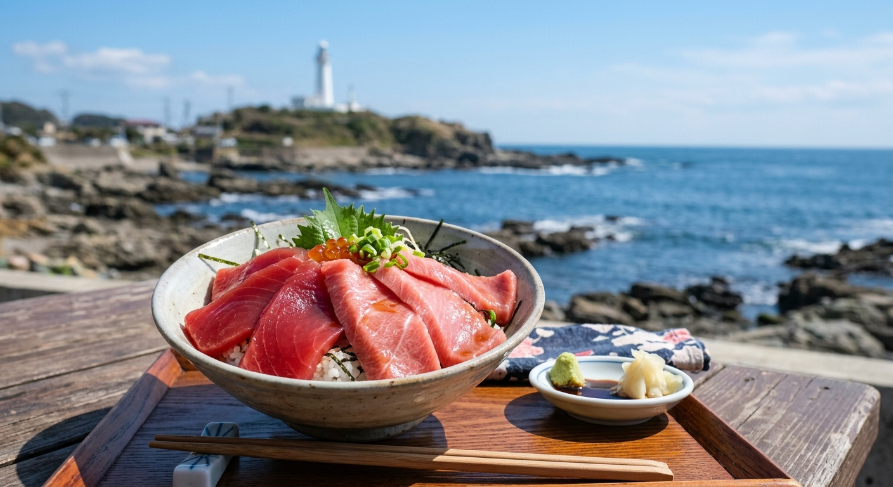

---
title: "【神奈川・三浦半島】施設の選び方からアクセス・三崎マグロまで完全ガイド"
publishDate: 2026-03-22
updatedDate: 2026-07-08
draft: false
category: "釣り旅ガイド"
prefecture: "kanagawa"
region: "east-japan"
slug: "kanagawa-miura-trip"
image: ./cover.jpg
tags:
  - "コラム"
  - "旅行"
  - "神奈川県"
  - "三浦半島"
  - "三崎マグロ"
description: "三浦半島の海上釣り堀2施設を比較し、三崎マグロ×城ヶ島ハイキングを組み合わせた日帰りモデルコースを解説。京急一本で品川から1時間。アクセス（車・京急）の概要もこの記事で整理。"
---

三浦半島は品川から京急快特で約1時間、都心から最も近い本格海上釣り堀エリアのひとつです。「週末の半日を使って大物と格闘し、三崎マグロで締める」という日帰りプランが定番。専用のアクセスガイドは未整備のため、この記事でアクセス概要も整理しています。

---

## このガイドが向いている人

| あなたの状況 | このガイドの使い方 |
| :--- | :--- |
| 三浦半島に初めて行く | 施設比較→アクセス→モデルコースの順に読む |
| 電車（京急）で行けるか調べたい | アクセスセクションへ |
| 三崎マグロ・観光とセットで楽しみたい | グルメ・観光セクションへ |
| 釣りと観光の両方を1日で済ませたい | 日帰りモデルコース表へ |
| <strong>釣り初心者で何も分からない</strong> | <strong>→ [初めての海上釣り堀ガイド](/tactics/beginner/first-fishing-pond)</strong> |

---

## 三浦半島の施設比較

エリア内で特性の異なる2施設があります。

| 施設 | エリア | 向いている人 | 魚種の特徴 | 子連れ | 電車アクセス |
| :--- | :--- | :--- | :--- | :--- | :--- |
| <strong>[みうら海王](/fishing-facility/miura-kaiou/)</strong> | 三崎 | 初心者〜ベテラン・スタッフ補助あり | マダイ・ワラサ・ヒラメ・シマアジ | ○ | 三崎口駅からタクシー約10〜15分 |
| <strong>[城ヶ島J'sフィッシング](/fishing-facility/jogashima-js-fishing/)</strong> | 城ヶ島 | 絶景重視・ロケーション優先 | マダイ・青物 | △（城ヶ島大橋あり） | 三崎口駅からタクシー約20分 |

> <strong>迷ったら</strong>：初めてなら<strong>みうら海王</strong>（スタッフサポート手厚い・規模大）。景色重視なら<strong>J'sフィッシング</strong>（相模湾を見渡す絶景）。

---

## アクセス概要

詳細は ▶ <strong>[関東アクセスガイド](/column/travel/access/access-kanto)</strong>（車・京急・アクアライン・渋滞対策を一覧比較）

以下は三浦半島に絞った概要です。

### あなたに向いている手段

| 状況 | 向いている手段 |
| :--- | :--- |
| 竿ケース＋クーラー持参 | <strong>車一択</strong> |
| 家族・子連れ（3名以上） | <strong>車</strong> |
| 荷物少なめ・お酒も飲みたい | <strong>京急線＋タクシー / みさきまぐろきっぷ</strong> |
| コスト重視の日帰り | <strong>京急線（品川〜三崎口 約1時間・約810円）</strong> |

### 車でのアクセス

| 出発地 | ルート | 所要時間 |
| :--- | :--- | :--- |
| 品川・目黒 | 第三京浜→横横→三浦縦貫道 | 約1時間〜1時間20分 |
| 横浜 | 横横→三浦縦貫道 | 約45分〜1時間 |
| 東京都心（環八経由） | 第三京浜→横横 | 約1時間15分〜1時間30分 |

<strong>渋滞の地雷</strong>：週末の横横（衣笠IC〜津久井浜IC）と三浦縦貫道は12〜14時に混みやすい。帰りは三崎港から横横に出るまでの一般道が15〜17時にピーク。<strong>釣り堀終了後すぐ移動する</strong>か、<strong>三崎でマグロを食べて17時以降に出発</strong>すると回避しやすい。

<strong>駐車場</strong>：みうら海王は専用駐車場完備。城ヶ島方面は城ヶ島大橋周辺の有料駐車場を利用（1回500〜700円程度）。

### 電車（京急線）でのアクセス

| 経路 | 所要時間 | 料金目安 |
| :--- | :--- | :--- |
| 品川→三崎口（快特） | 約1時間 | 約810円 |
| 横浜→三崎口（快特） | 約50分 | 約670円 |

三崎口駅から施設へはタクシーが現実的です（みうら海王まで約10〜15分・1,500〜2,000円）。早朝の場合は<strong>前日に電話予約</strong>を入れておくと確実。

<strong>「みさきまぐろきっぷ」活用</strong>：京急線往復＋三崎エリアのマグロランチ＋観光施設がセットになったお得きっぷ（品川発2,820円〜）。釣り堀代は対象外ですが、昼食代が実質無料になるため釣り後のグルメコストを大幅に削減できます。

> 竿ケース＋クーラーで三崎口まで電車移動するのは改札・乗り換えで苦労します。釣具が多い場合は車の方が現実的です。

### アクセス計画のチェックリスト

- [ ] 移動手段の確定（車・京急線）
- [ ] ETCカードの確認（車の場合）・横横道路料金（片道約610円）の確認
- [ ] タクシーの事前予約（電車利用・早朝は必須）
- [ ] 帰路の渋滞予測（NEXCO東日本）
- [ ] 施設の集合時間・場所・駐車場の確認

---

## おすすめの日帰りモデルコース

| 時間 | <strong>午前：三浦着・釣り</strong> | <strong>午後：三崎グルメ・観光</strong> |
| :--- | :--- | :--- |
| <strong>08:00</strong> | 品川・横浜から三浦方面へ（京急快特） | 城ヶ島公園で奇岩ハイキング |
| <strong>09:30</strong> | みうら海王またはJ'sフィッシング到着 | 三崎港（うらり）でお土産・鮮魚購入 |
| <strong>昼食</strong> | 三崎港の老舗でマグロ三昧ランチ | 秋谷・葉山周辺のカフェで休憩 |
| <strong>夕刻</strong> | 城ヶ島温泉でひとっ風呂（任意） | 釣果を持って帰路へ（17時以降推奨） |

---

## グルメ：三浦で必ず食べたい2品

### 三崎マグロ

全国有数のマグロ水揚げ量を誇る三崎港が本拠地。市内には専門店が密集しており、中トロ・カマ焼き・マグロのホルモン料理など、スーパーでは食べられないバリエーションが揃います。ランチで1,500〜2,500円台の充実した定食が食べられます。

### 三浦野菜（三浦大根・キャベツ）

潮風で育った三浦の野菜は甘みが強い。「うらりマルシェ」や地元の直売所で購入できます。お土産として持ち帰りやすく、釣果と一緒に家族へのお土産として定番。

---

## 観光：城ヶ島と三浦の自然

### 城ヶ島公園

島全体が公園で、奇岩が並ぶ海岸線のハイキングコースが絶景です。「馬の背洞門」と呼ばれる自然のアーチは三浦を象徴するフォトスポット。城ヶ島大橋を渡って徒歩でも回れます（所要40〜60分）。

### ソレイユの丘（長井海の手公園）

2023年リニューアルの体験型パーク。ゴーカート・アスレチック・動物ふれあい・キャンプ場を完備。釣り後に子供を連れてきても十分に楽しめます。

---

## 宿泊先選び：1泊にして早朝便を楽しみたい場合

三浦半島は日帰り圏内ですが、<strong>早朝便から釣行したい・渋滞を避けてゆったり回りたい</strong>場合は前泊も選択肢になります。

- <strong>施設まで車で30分以内</strong>の宿を選ぶ（三崎・城ヶ島周辺なら移動負担なし）
- <strong>素泊まりプランで十分</strong>：早朝集合の場合は朝食時間より前に出発することが多い
- 三崎港周辺の民宿・城ヶ島の宿は<strong>マグロ料理が自慢</strong>のところが多く、前夜から三崎グルメを楽しめる

| 宿泊エリア | 特徴 | 向いている人 |
| :--- | :--- | :--- |
| <strong>三崎港周辺</strong> | 民宿・旅館が点在。マグロ料理を出す宿が多い | みうら海王を利用する早朝釣行派 |
| <strong>城ヶ島</strong> | 島内の宿から絶景・城ヶ島温泉が近い | J'sフィッシング利用・観光重視派 |

移動費・前泊の考え方全般は[遠征釣行ガイド（全国版）](/column/travel/access/ensei-guide)も参考にしてください。

---

## よくある質問（FAQ）

<strong>Q1. 日帰りで往復できますか？</strong>  
品川から京急1時間なので日帰り最適エリアです。ただし帰路の渋滞（15〜17時）には注意。17時以降の出発で大幅に緩和されます。

<strong>Q2. 子供を連れて行っても大丈夫ですか？</strong>  
みうら海王はスタッフが常駐しており初心者サポートが手厚いです。釣り初体験の流れは▶ [初めての海上釣り堀ガイド](/tactics/beginner/first-fishing-pond)

<strong>Q3. 竿がなくても大丈夫ですか？</strong>  
みうら海王はレンタルタックルあり（予約時に確認）。手ぶらで来ても始められます。

<strong>Q4. みさきまぐろきっぷで釣り堀代は払えますか？</strong>  
釣り堀利用料は対象外です。交通費と昼食代の節約に使うきっぷとして活用してください。

---

## 関連ページ

- みうら海王: [/fishing-facility/miura-kaiou/](/fishing-facility/miura-kaiou/)
- 城ヶ島J'sフィッシング: [/fishing-facility/jogashima-js-fishing/](/fishing-facility/jogashima-js-fishing/)
- <strong>[関東アクセスガイド](/column/travel/access/access-kanto)</strong>: 千葉・神奈川を含む関東広域エリア比較・渋滞対策
- <strong>[遠征釣行ガイド（全国版）](/column/travel/access/ensei-guide)</strong>——移動費・釣具配送・前泊のノウハウまとめ
- 初めての海上釣り堀ガイド: [/tactics/beginner/first-fishing-pond](/tactics/beginner/first-fishing-pond)
