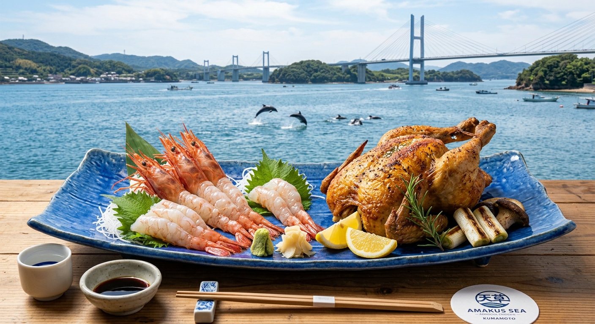

## はじめに
熊本県、天草エリアは、古くから豊かな漁場として知られ、九州の釣り人にとって憧れの「聖地」の一つ。三角（みすみ）から五つの橋を渡って島々を巡る「天草パールライン」は、日本屈指のドライブコースでもあります。穏やかな内海の海面と、ダイナミックな外海の恩恵を同時に受けられるこのエリアは、海上釣り堀の拠点としても非常に優秀。

今回は、九州の豊かな自然を五感で堪能する、天草満喫1泊2日の旅をご提案します。

## 海上釣り堀：九州トップクラスのポテンシャル
天草の釣り堀は、潮通しが良い場所に設置され、放流される魚のコンディションが非常に良いことで定評があります。

### 注目施設
- <strong>[天草楽釣り（らくつり）](/fishing-facility/west-japan/kumamoto/amakusa-rakutsuri)</strong>: 
  上天草市にある大人気の海上釣り堀。潮の流れが速い場所にあるため、魚の引きが非常に力強く、マダイや青物を狙う本格派から、ファミリーまで幅広い層が楽しめます。スタッフが丁寧に教えてくれるため、初めての方でも安心して「爆釣」の快感を味わえます。
- <strong>[天草レジャーランド](/fishing-facility/west-japan/kumamoto/amakusa-leisure-land)</strong>: 
  静かな海域に大型の生簀（いけす）を構える施設。まるで海の上で過ごしているかのような感覚で、マダイやブリ、カンパチなどの高級魚を狙えます。
- <strong>[つりぼり知十（ちじゅう）](/fishing-facility/west-japan/kumamoto/kaijo-tsuribori-tsuriichi)</strong>: 
  （※熊本・天草エリアの有力スポットの一つ）内海ならではの穏やかさの中で、じっくりと魚との駆け引きを楽しめるため、ベテランの方にも人気が高いスポットです。

## グルメ：プリプリの「車えび」と「天草大王」
天草は、まさに「美味しいものの宝庫」です。

- <strong>車えび</strong>: 
  天草は車えび養殖発祥の地。新鮮な車えびをその場で剥いて頂くお刺身や、豪快に塩焼きにした逸品は、甘みが強くプリプリとした食感。一度食べたら他のえびが食べられなくなるほどの美味しさです。
- <strong>天草大王（地鶏）</strong>: 
  かつて絶滅したとされる日本最大級の地鶏を復活させた「天草大王」。肉質が非常にジューシーで旨みが深く、炭火焼きや水炊きは絶品。釣りの後の夕食に最高のご馳走です。
- <strong>海鮮丼（天草海鮮蔵）</strong>: 
  地元で獲れた数十種類の地魚が贅沢に盛られた海鮮丼。天草の海の豊かさを一口で実感できます。

## 観光：野生のイルカに会える海
釣りの後は、天草を象徴するアクティビティ、イルカウォッチングへ。

- <strong>野生のミナミハンドウイルカ</strong>: 
  五和町（いつわまち）の沖合には、年間を通じて約200頭の野生のイルカが生息しています。遭遇率は驚異の90％以上！船のすぐそばまで近寄ってくるイルカたちの姿は、お子様だけでなく大人も大興奮間違いなしです。
- <strong>天草五橋（パールライン）</strong>: 
  三角から大矢野島、永浦島、大池島、前島を経て天草上島を結ぶ5つの橋。橋ごとに異なる景色と、島々の美しさが織りなすパノラマは圧巻です。

## おすすめの1泊2日モデルコース

| 時間 | <strong>1日目：橋を渡って釣り三昧</strong> | <strong>2日目：イルカと絶景の旅</strong> |
| :--- | :--- | :--- |
| <strong>AM</strong> | 天草楽釣りでマダイ爆釣体験！ | 五和町よりイルカウォッチングに出航 |
| <strong>昼食</strong> | 「車えび料理専門店」で贅沢ランチ | 下天草で「天草大王の親子丼」を堪能 |
| <strong>PM</strong> | 天草五橋を巡る絶景ドライブ & 写真撮影 | 「リゾラテラス天草」でお洒落ショッピング |
| <strong>夕刻</strong> | 下田温泉の夕陽が見える宿へ宿泊 | 松島ICより熊本・有明方面へ帰路 |

## まとめ
島々を結ぶ橋の美しさ、生命力溢れる魚たちとの格闘、そして野生のイルカとの出会い。天草での1泊2日は、日常を忘れさせてくれる圧倒的なパワーに満ちています。次の連休、九州が誇る「宝の島」天草へ、最高の釣行旅行に出かけてみませんか？
