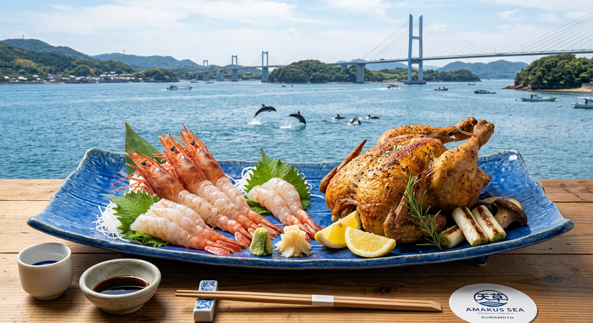

九州の南西に浮かぶ天草諸島。熊本市から九州道→松橋IC経由で天草上島まで車で約70分、九州トップクラスの魚影と野生のイルカに会える唯一のエリアです。ただし島の中でも施設の場所が分散しているため、どの施設を選ぶかで移動コストが変わります。

---

## このガイドが向いている人

| あなたの状況 | このガイドの使い方 |
| :--- | :--- |
| 熊本・福岡から1泊2日で天草釣行を計画中 | 比較表→モデルコースの順に読む |
| イルカウォッチングと釣りをセットで楽しみたい | モデルコース表と観光セクションへ |
| 車えびや天草大王を食べたい | グルメセクションへ |
| 子供を連れてスタッフ常駐の釣り堀を探している | 施設比較の天草楽釣りを確認 |
| **釣り初心者で何も分からない** | **→ [初めての海上釣り堀ガイド](/tactics/beginner/first-fishing-pond)** |

---

## 天草エリアの施設比較

| 施設 | 向いている人 | 特徴 | 子連れ | アクセス |
| :--- | :--- | :--- | :--- | :--- |
| **[天草楽釣り](/fishing-facility/west-japan/kumamoto/amakusa-rakutsuri)** | ファミリー〜本格派・初心者 | 上天草・スタッフ丁寧・潮通し良好・マダイ〜青物 | ◎ | 松橋ICから車で約70分 |
| **[天草レジャーランド](/fishing-facility/west-japan/kumamoto/amakusa-leisure-land)** | 大型狙いの本格派 | 大型生簀・マダイ/ブリ/カンパチ | ○ | 松橋ICから車で約70分 |
| **[つりぼり知十](/fishing-facility/west-japan/kumamoto/kaijo-tsuribori-tsuriichi)** | ベテラン・静かな釣り環境重視 | 内海・穏やか・じっくり魚との駆け引き | ○ | 松橋ICから車で約60分 |

> **迷ったら**：子連れ・初心者を含むグループは**天草楽釣り**。大型狙いの本格派は**天草レジャーランド**。ベテランでじっくり釣りたいなら**つりぼり知十**。

---

## アクセス概要

| 出発地 | 手段 | 所要時間 | 備考 |
| :--- | :--- | :--- | :--- |
| 熊本市内 | 車（九州道→松橋IC→国道266号） | 約70分 | 天草五橋経由 |
| 福岡（博多） | 車（九州道→松橋IC） | 約2時間20分 | 松橋IC→天草まで+約70分 |
| 熊本市内 | 快速バス「あまくさ号」 | 約2時間（本渡まで） | 熊本バスセンター発・竿ケースNG |
| 熊本・三角駅 | JR三角線→宝島ライン（観光船） | 約3〜4時間（観光コース） | アクティビティとしての移動 |

**渋滞注意**：天草五橋（国道266号）は週末・連休に渋滞が発生しやすい。行きは早朝5〜6時台、帰りは15時以前か20時以降に出発すると緩和しやすい。  
**バス利用の注意**：「あまくさ号」への大型荷物（竿ケース・クーラー）持ち込みは原則不可。レンタルタックルで手ぶら釣行の場合のみ現実的。  
**島内移動**：天草は島が広く施設間の距離もある。島内でレンタカーを借りると行動自由度が上がる。

> 詳細な九州エリアアクセスガイドは準備中です。

---

## おすすめの1泊2日モデルプラン

| 時間 | **1日目：橋を渡って釣り三昧** | **2日目：イルカと絶景ドライブ** |
| :--- | :--- | :--- |
| **早朝** | 天草楽釣りでマダイ爆釣（集合7:00） | 五和町よりイルカウォッチング乗船（9〜10時出港） |
| **午前** | 釣り（放流タイムが最高潮） | 野生イルカに大接近（遭遇率90%以上） |
| **昼食** | 「車えび料理専門店」で贅沢ランチ | 下天草で「天草大王の親子丼」 |
| **午後** | 天草五橋（パールライン）絶景ドライブ | リゾラテラス天草でショッピング |
| **夕刻** | 下田温泉の夕陽が見える宿へ宿泊 | 松橋IC〜熊本・福岡方面へ帰路 |

**ポイント**：イルカウォッチング（五和町・通詞島周辺）は天草楽釣りから車で約30〜40分。2日目の午前に組み込むのが動線としてスムーズ。

---

## グルメ：天草で必ず食べたい2品

### 車えび（天草の特産品）

天草は車えび養殖発祥の地。新鮮な活き車えびの刺身・塩焼きは甘みとプリプリの食感が格別。専門店では養殖いけすから揚げたてを調理。予算は1人3,000〜6,000円が目安。

### 天草大王（地鶏）

かつて絶滅したとされる日本最大級の地鶏を復活させた天草の宝。肉質がジューシーで旨みが深く、炭火焼きや水炊きは絶品。釣りの後の夕食として宿でのコースに組み込まれることも多い。

---

## 観光：天草で外せない2か所

### 野生イルカウォッチング（五和町・通詞島）

五和町の沖合に年間を通じて約200頭の野生のミナミハンドウイルカが生息。遭遇率90%以上の国内屈指のスポット。乗船ツアーは90〜120分で事前予約推奨（GW・夏は1ヶ月前から）。

### 天草五橋（パールライン）

三角から5つの橋で島々を渡るドライブルート。橋ごとに異なる海の色と島影のパノラマが楽しめる。通行無料で、車移動の途中でいつでも立ち寄れる。

---

## よくある質問（FAQ）

**Q1. 電車だけで天草の釣り堀に行けますか？**  
JR三角線の終点・三角駅から宝島ライン（観光船）で天草に入ることはできますが、釣り施設への接続が悪く現実的ではありません。バス（あまくさ号）なら本渡まで行けますが、釣具を持参する場合は車が唯一の選択肢です。

**Q2. 福岡から日帰りは可能ですか？**  
福岡から松橋ICまで約1時間30分、そこから天草まで約70分の計2時間20分かかります。釣り（7時〜12時）を終えて17時帰着は可能ですが、渋滞リスクを考えると1泊推奨。

**Q3. イルカウォッチングと釣りは1日で両立できますか？**  
釣りが午前終了（〜12時）なら、午後のイルカウォッチング（13〜16時）は可能です。ただし両方の施設が離れているため1泊2日で1日ずつ行う方が余裕があります。

**Q4. 子供向けのレンタルタックルはありますか？**  
天草楽釣りはレンタルタックル完備でファミリー対応。初心者・子連れへのスタッフサポートも充実しています（施設に要確認）。

**Q5. イルカウォッチングは年中できますか？**  
年間を通じて実施されています。ただし悪天候時は欠航するため、出発前に運営会社に確認を。夏は早朝便が人気のため早めの予約が必要です。

---

## 関連ページ

- 天草楽釣り: [/fishing-facility/west-japan/kumamoto/amakusa-rakutsuri](/fishing-facility/west-japan/kumamoto/amakusa-rakutsuri)
- 天草レジャーランド: [/fishing-facility/west-japan/kumamoto/amakusa-leisure-land](/fishing-facility/west-japan/kumamoto/amakusa-leisure-land)
- つりぼり知十: [/fishing-facility/west-japan/kumamoto/kaijo-tsuribori-tsuriichi](/fishing-facility/west-japan/kumamoto/kaijo-tsuribori-tsuriichi)
- 初めての海上釣り堀ガイド: [/tactics/beginner/first-fishing-pond](/tactics/beginner/first-fishing-pond)
