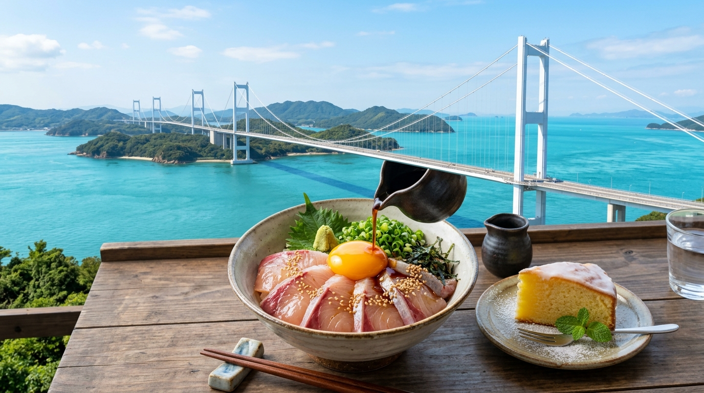

## はじめに
広島県尾道市と愛媛県今治市を繋ぐ「しまなみ海道」。青い海に浮かぶ島々を橋で渡るこのルートは、絶景のドライブコースであり、サイクリストの聖地としても知られています。しかし、釣り人にとってもここは「潮の流れが速く、豊かな魚影を誇る」特別なフィールド。

今回は、自転車やバイクで島を巡りながら、本格的な海上釣り堀を楽しむ、アクティブで贅沢なモデルプランをご提案します。

## 海上釣り堀：潮の流れが生む「筋肉質な魚」
しまなみエリアの釣り堀は、瀬戸内海の速い潮流をイケスに取り込んでいるため、魚の引きが非常に力強いのが特徴です。

### 注目施設
- <strong>[しまなみ海道フィッシングパーク](/fishing-facility/west-japan/hiroshima/shimanami-kaido-fishing-park)</strong>: 
  大三島（愛媛県側ですが、広島側からもアクセス良好）にある、しまなみ観光の拠点にぴったりの施設。足場が広く整備されており、レンタサイクルで立ち寄ることも可能。マダイやハマチの放流が盛んで、観光の合間に本格的な格闘を楽しめます。
- <strong>[フィッシングパーク大三島](/fishing-facility/west-japan/ehime/fishing-park-omishima)</strong>: 
  同じく大三島に位置する、より自然豊かな雰囲気の施設。イケスだけでなく、周囲の海域も絶好のポイントとして知られており、島全体の「釣り熱」を肌で感じることができます。
- <strong>[海上釣り堀 海遊（因島）](/fishing-facility/west-japan/hiroshima/kaijo-tsuribori-kaiyu)</strong>: 
  因島にある、潮通しの良さが自慢の釣り堀。ベテラン勢も唸る大型の放流があり、しまなみ屈指の実力派スポットとして知られています。

## グルメ：愛媛の「鯛めし」と広島の「レモン料理」
複数の島を跨ぐ旅だからこそ、両県のご当地グルメをハシゴするのが醍醐味です。

- <strong>鯛めし（二つの流儀）</strong>: 
  今治側では鯛を丸ごと炊き込む「炊き込み鯛めし」、宇和島方面の流れを汲む店では刺身を特製ダレと卵で頂く「宇和島流鯛めし」。しまなみでは両方を出す店が多く、贅沢な食べ比べが楽しめます。
- <strong>レモン・はっさくスイーツ</strong>: 
  国産レモン発祥の地・生口島（いくちじま）のレモンケーキや、因島のはっさく大福。サイクリングで疲れた身体に、爽やかな酸味が染み渡ります。

## 観光：亀老山（きろうさん）からの夕日
釣りの締めくくりは、世界も認める絶景ポイントへ。

- <strong>亀老山展望公園（大島）</strong>: 
  しまなみ海道随一の展望を誇るスポット。来島海峡大橋（くるしまかいきょうおおはし）を眼下に、沈みゆく夕日と赤く染まる海面を眺める時間は、一生の思い出に残るはずです。

## おすすめの1泊2日モデルコース

| 時間 | <strong>1日目：尾道〜大三島</strong> | <strong>2日目：大三島〜今治</strong> |
| :--- | :--- | :--- |
| <strong>AM</strong> | 尾道よりサイクリング開始 | フィッシングパーク大三島で大物狙い！ |
| <strong>昼食</strong> | 生口島で「レモンポーク丼」ランチ | 大三島で「炊き込み鯛めし」を堪能 |
| <strong>PM</strong> | 耕三寺や未来心の丘を散策 | 亀老山展望台からのパノラマビュー |
| <strong>夕刻</strong> | 大三島の旅館で釣った魚を懐石料理に | 今治で「焼鳥」を楽しみ帰路へ |

## まとめ
潮風を切って走る爽快感と、イケスの中で暴れる巨大魚の躍動感。しまなみ海道は、日常を「動」と「静」の両方向からリセットしてくれる魔法の場所です。次の連休は、釣竿と冒険心を持って、島々を結ぶ白い橋を渡ってみませんか？
