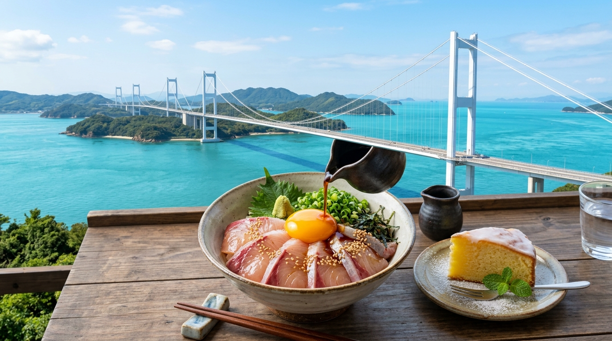

---
title: "【しまなみ海道】施設の選び方からサイクリング・鯛めし・尾道まで完全ガイド"
publishDate: 2026-03-22
updatedDate: 2026-05-28
draft: false
category: "釣り旅ガイド"
prefecture: "ehime"
region: "west-japan"
slug: "shimanami-cycling-fishing"
image: ./cover.jpg
tags:
  - "コラム"
  - "旅行"
  - "広島県"
  - "愛媛県"
  - "しまなみ海道"
description: "しまなみ海道の海上釣り堀3施設を比較し、サイクリング×鯛めし×亀老山絶景を組み合わせた1泊2日モデルコースを解説。大阪から尾道まで約2時間30分。車・電車＋レンタサイクルの両ルートを整理。"
---

広島・尾道から愛媛・今治を結ぶしまなみ海道。瀬戸内海の速い潮流に育まれた魚の引きの強さは別格です。ただし島々に点在する施設への「ラストマイル」が複雑なため、起点と移動手段の選択が重要になります。

---

## このガイドが向いている人

| あなたの状況 | このガイドの使い方 |
| :--- | :--- |
| 釣りとサイクリングを1泊2日で組み合わせたい | モデルコース表へ |
| 大阪・神戸から車でしまなみ海道へ行く | アクセス概要→施設比較の順に読む |
| 鯛めしや瀬戸内グルメも楽しみたい | グルメセクションへ |
| 釣りは初めてで潮流が強い海域でも大丈夫か不安 | FAQとビギナーガイドを参照 |
| <strong>釣り初心者で何も分からない</strong> | <strong>→ [初めての海上釣り堀ガイド](/tactics/beginner/first-fishing-pond)</strong> |

---

## しまなみエリアの施設比較

| 施設 | 向いている人 | 特徴 | 子連れ | アクセス |
| :--- | :--- | :--- | :--- | :--- |
| <strong>[しまなみ海道フィッシングパーク](/fishing-facility/shimanami-kaido-fishing-park/)</strong> | 観光ついで・サイクリスト | 大三島・足場広い・レンタサイクルで立ち寄り可 | ○ | 大三島IC・今治北ICから車で約20〜30分 |
| <strong>[フィッシングパーク大三島](/fishing-facility/fishing-park-omishima/)</strong> | 自然重視・じっくり釣り | 大三島・瀬戸内の自然豊かな環境 | ○ | 大三島ICから車で約10分 |
| <strong>[海上釣り堀 海遊（因島）](/fishing-facility/kaijo-tsuribori-kaiyu/)</strong> | 実釣優先・大型狙いのベテラン | 因島・潮通し良好・大型放流あり | ○ | 因島北ICから車で約15分 |

> <strong>迷ったら</strong>：サイクリングとセットで観光的に楽しむなら<strong>しまなみ海道フィッシングパーク</strong>。実釣メインで大型を狙うなら<strong>海遊（因島）</strong>。ゆっくり島時間を楽しむなら<strong>大三島</strong>。

---

## アクセス概要

| 出発地 | 手段 | 所要時間 | 備考 |
| :--- | :--- | :--- | :--- |
| 大阪（梅田） | 車（山陽道→尾道IC→しまなみ海道） | 約2時間30分〜3時間（尾道まで） | 尾道から大三島まで+約60〜80分 |
| 広島市内 | 車（山陽道→尾道IC） | 約1時間（尾道まで） | |
| 福岡（博多） | 車（山陽道） | 約3時間30分（尾道まで） | |
| 大阪 | 新幹線→尾道 or 今治 | 約2時間（福山駅乗換） | タクシー or レンタサイクル必要 |

<strong>しまなみ海道の通行料</strong>：尾道IC〜今治IC（全線）はETC約2,900円（普通車）。大三島ICで降りる場合は約1,500〜2,000円が目安。  
<strong>サイクリストの注意</strong>：自転車での施設アクセスは可能だが、釣具（竿ケース・クーラー）持参時は車が必須。レンタルタックルで手ぶら釣行なら自転車でも。

> 詳細な四国・中国エリアアクセスガイドは準備中です。

---

## おすすめの1泊2日モデルプラン

| 時間 | <strong>1日目：尾道〜大三島</strong> | <strong>2日目：釣りと絶景</strong> |
| :--- | :--- | :--- |
| <strong>早朝</strong> | 尾道よりしまなみ海道ドライブ開始 | フィッシングパーク大三島で大物狙い（集合7:00） |
| <strong>午前</strong> | 生口島・耕三寺や未来心の丘を散策 | 釣り（放流タイムが最高潮） |
| <strong>昼食</strong> | 生口島で「レモンポーク丼」ランチ | 大三島で「炊き込み鯛めし」を堪能 |
| <strong>午後</strong> | しまなみ海道フィッシングパークで夕方の一投 | 亀老山展望公園で来島海峡大橋のパノラマ |
| <strong>夕刻</strong> | 大三島の旅館で瀬戸内懐石料理 | 尾道 or 今治より帰路へ |

<strong>ポイント</strong>：亀老山展望公園（大島）は道が急坂なので車での訪問推奨。夕日時刻（17〜18時台）に合わせると来島海峡大橋が赤く染まる絶景が見られる。

---

## グルメ：しまなみで必ず食べたい2品

### 鯛めし（今治流と宇和島流の食べ比べ）

今治側では鯛を丸ごと炊き込む「炊き込み鯛めし」、宇和島流は刺身を特製ダレと生卵で混ぜて食べる「ひゅうが飯」スタイル。しまなみの旅館では両方出す店もあり、瀬戸内ならではの食べ比べが楽しめる。

### レモン・はっさくスイーツ（生口島・因島）

国産レモン発祥の地・生口島（いくちじま）のレモンケーキ、因島のはっさく大福。サイクリングや釣りで疲れた身体に爽やかな酸味が染み渡る。道の駅での手軽な立ち寄りもできる。

---

## 観光：しまなみで外せない2か所

### 亀老山展望公園（大島）

しまなみ海道随一の展望スポット。来島海峡大橋を眼下に、夕日と赤く染まる海面が重なる景色は絶景。所要30〜45分。

### 未来心の丘（生口島・耕三寺）

イタリア産の白い大理石で覆われた丘。地中海を思わせる幻想的な空間で、インスタ映えスポットとして人気。耕三寺境内（有料）内にある。

---

## よくある質問（FAQ）

<strong>Q1. 竿ケースを持って電車でしまなみ海道に行けますか？</strong>  
新幹線で福山駅まで行き、在来線で尾道駅へ移動は可能。しかし島の施設へは渡船やバスを乗り継ぐ必要があり、大型釣具持参は困難。レンタルタックル（手ぶら）ならバス+渡船+タクシーで行ける施設もあります。

<strong>Q2. 大阪から日帰りは可能ですか？</strong>  
尾道まで片道2時間30分〜3時間かかるため、日帰りは移動がタイト。釣り+観光を楽しむなら1泊2日を推奨。

<strong>Q3. 釣った魚は持ち帰れますか？</strong>  
クーラーボックスと氷があれば持ち帰り可能。旅館での活造りや宿で捌いてもらうサービスを利用するのも選択肢です。

<strong>Q4. 子連れでも楽しめますか？</strong>  
しまなみ海道フィッシングパークは足場が広く整備されており子連れ向き。釣り施設のファミリーコースや施設の子供向け対応を事前確認してください。

<strong>Q5. しまなみ海道通行料の割引はありますか？</strong>  
ETC搭載車は休日割引が適用。普通車の尾道IC〜今治IC全線はETC約2,900円（平日は高め）。途中ICで降りると金額が下がります。

---

## 関連ページ

- しまなみ海道フィッシングパーク: [/fishing-facility/shimanami-kaido-fishing-park/](/fishing-facility/shimanami-kaido-fishing-park/)
- フィッシングパーク大三島: [/fishing-facility/fishing-park-omishima/](/fishing-facility/fishing-park-omishima/)
- 海上釣り堀 海遊（因島）: [/fishing-facility/kaijo-tsuribori-kaiyu/](/fishing-facility/kaijo-tsuribori-kaiyu/)
- 初めての海上釣り堀ガイド: [/tactics/beginner/first-fishing-pond](/tactics/beginner/first-fishing-pond)
