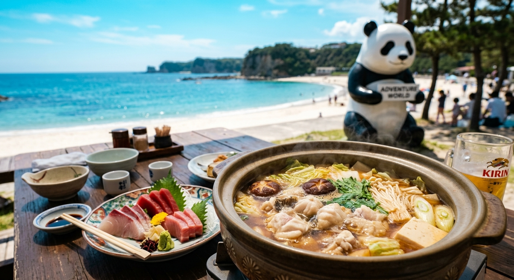

## はじめに
関西を代表するリゾート地、南紀白浜。古くから美白の砂浜と良質な温泉で知られてきましたが、実はここは「ファミリーフィッシング」の聖地でもあります。波が穏やかで魚影が濃い紀州の海は、海上釣り堀初心者にとっても最高のフィールド。

今回は、パパは爆釣、ママは温泉、お子様はパンダ！家族全員の願いが一度に叶う、白浜満喫プランをご提案します。

## 海上釣り堀：西日本最大級のイケスに挑む
白浜周辺には、全国から釣り人が集まる超有名施設が点在しています。

### 注目施設
- <strong>[カタタの釣堀](/fishing-facility/west-japan/wakayama/kakata-fishing-pond)</strong>: 
  「とれとれ市場」のすぐ裏手にある、西日本最大級の海上釣り堀。とにかく規模が大きく、放流されている魚の種類も豊富。マダイや青物だけでなく、季節によっては大きなクエが放流されることも。管理が非常に行き届いており、女性や子供でも安心して大物を狙えます。
- <strong>[海上釣り堀 紀州](/fishing-facility/west-japan/wakayama/tsuribori-kishu)</strong>: 
  白浜から車ですぐの広川にある、歴史ある名門釣り堀。非常に活性の高い魚たちが放流されており、「とにかく釣りたい！」という熱いパパたちから圧倒的な支持を得ています。
- <strong>[和歌山マリーナシティ海釣り公園](/fishing-facility/west-japan/wakayama/wakayama-marinacity-fishing-park)</strong>: 
  （帰路に立ち寄るのにおすすめ）和歌山市内に位置し、テーマパークとセットで楽しめる海釣り公園。足場が良く、手ぶらでサビキ釣りと本格的な釣り堀の両方が楽しめます。

## グルメ：幻の魚「クエ」ととれとれ市場の海鮮
紀伊半島の豊かな海が育む美食は、まさに白浜の醍醐味です。

- <strong>クエ料理</strong>: 
  冬から春にかけてが旬の、まさに「幻の高級魚」。白浜はクエの養殖や漁が盛んで、専門店で頂く「クエ鍋」や「薄造り」は、他では味わえない濃厚な旨みと上品な脂が特徴です。
- <strong>とれとれ市場の海鮮</strong>: 
  西日本最大級の魚市場。市場内で購入した魚をそのままBBQコーナーで焼いて食べたり、特製の海鮮丼を堪能したり。釣った魚と一緒に、ここでしか買えない「梅干し」や「地酒」をお土産にするのも忘れずに。

## 観光：アドベンチャーワールドと三段壁
釣りの後は、白浜ならではのアクティビティへ。

- <strong>アドベンチャーワールド</strong>: 
  日本一のパンダファミリーに会えるテーマパーク。動物園、水族館、遊園地が一体となっており、1日あっても足りないほどのボリュームです。
- <strong>三段壁（さんだんべき）洞窟</strong>: 
  断崖絶壁の下にある洞窟へ。かつて熊野水軍の隠れ家だったとされる歴史遺構で、打ち付ける波の迫力は圧巻。お子様の冒険心をくすぐります。

## おすすめの1泊2日モデルプラン

| 時間 | <strong>1日目：巨大釣り堀で爆釣</strong> | <strong>2日目：パンダと絶景巡り</strong> |
| :--- | :--- | :--- |
| <strong>AM</strong> | カタタの釣堀で朝から真鯛狙い！ | アドベンチャーワールドでパンダに遭遇 |
| <strong>昼食</strong> | とれとれ市場で「勝手丼」ランチ | 園内のサファリレストランでランチ |
| <strong>PM</strong> | 白良浜で波打ち際散歩＆足湯巡り | 三段壁洞窟でリアルRPG体験！ |
| <strong>夕刻</strong> | 白浜温泉の老舗旅館で「クエ料理」 | 白浜ICより大阪・京都方面へ帰路 |

## まとめ
大自然の躍動感を感じる釣り、心身を癒やす温泉、そして可愛らしい動物たち。南紀白浜は、家族の大切な時間を彩る全てが揃った「約束の地」です。次の週末、大切な家族を誘って、紀州の青い海へ出かけてみませんか？
