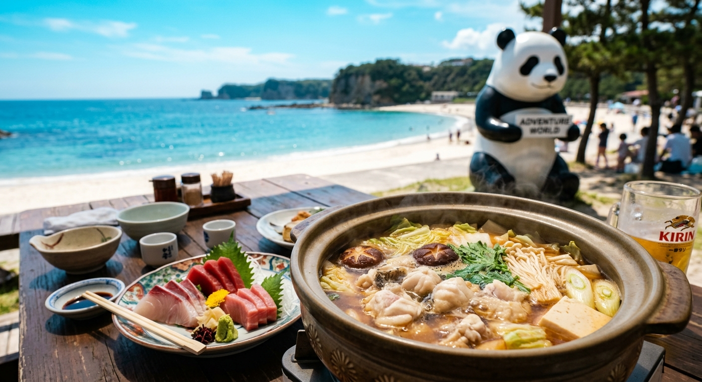

---
title: "【和歌山・白浜】施設の選び方からパンダ・温泉・クエ料理まで完全ガイド"
publishDate: 2026-03-22
updatedDate: 2026-07-08
draft: false
category: "釣り旅ガイド"
prefecture: "wakayama"
region: "west-japan"
slug: "shirahama-onsen-trip"
image: ./cover.jpg
tags:
  - "コラム"
  - "旅行"
  - "和歌山県"
  - "白浜"
  - "アドベンチャーワールド"
description: "和歌山・白浜の海上釣り堀3施設を比較し、アドベンチャーワールド×温泉×クエ料理を組み合わせた1泊2日モデルコースを解説。公式サイトに載っていない施設選びの判断基準を整理。交通情報は近畿アクセスガイドで詳しく解説。"
---

紀伊半島の南端、南紀白浜。パンダ・温泉・海上釣り堀の三拍子が揃うエリアです。ただし大阪から車で2時間以上かかるため「どの施設に行くか」と「日帰りか1泊か」の判断が重要です。

車・特急くろしおの詳細は別記事にまとめています。  
▶ <strong>[近畿・関西アクセス完全版（淡路島・白浜・大阪近郊の比較）](/column/travel/access/access-kinki)</strong>

---

## このガイドが向いている人

| あなたの状況 | このガイドの使い方 |
| :--- | :--- |
| 白浜に初めて家族で行く | 比較表→モデルコースの順に読む |
| パンダとクエ料理と釣りをセットで楽しみたい | モデルコース表とグルメセクションへ |
| 温泉宿に泊まりたい | 観光セクションへ |
| <strong>移動手段・阪和道の渋滞情報を調べたい</strong> | <strong>→ [近畿アクセスガイド](/column/travel/access/access-kinki)</strong> |
| <strong>釣り初心者で何も分からない</strong> | <strong>→ [初めての海上釣り堀ガイド](/tactics/beginner/first-fishing-pond)</strong> |

---

## 白浜エリアの施設比較

| 施設 | 向いている人 | 特徴 | 子連れ | アクセス |
| :--- | :--- | :--- | :--- | :--- |
| <strong>[カタタの釣堀](/fishing-facility/kakata-fishing-pond/)</strong> | 本格大物・ファミリー・観光ついで | 西日本最大級・とれとれ市場に隣接・マダイ〜クエ | ○ | 南紀田辺ICから車で約20分 |
| <strong>[釣堀紀州](/fishing-facility/tsuribori-kishu/)</strong> | 釣果優先・大阪からの日帰り | 大阪から90分・活性高い・ボウズ保証あり | ○ | 南紀田辺ICから車で約15分 |
| <strong>[和歌山マリーナシティ海釣り公園](/fishing-facility/wakayama-marinacity-fishing-park/)</strong> | 帰路の立ち寄り・手ぶら派 | 和歌山市内・テーマパーク隣接・サビキOK | ◎ | 阪和道 和歌山ICから近い |

> <strong>迷ったら</strong>：白浜で1泊するなら<strong>カタタの釣堀</strong>（とれとれ市場と温泉がセット）。大阪からの日帰りなら<strong>釣堀紀州</strong>。帰りに立ち寄るなら<strong>マリーナシティ</strong>。

---

## おすすめの1泊2日モデルプラン

| 時間 | <strong>1日目：巨大釣り堀で爆釣</strong> | <strong>2日目：パンダと絶景巡り</strong> |
| :--- | :--- | :--- |
| <strong>早朝</strong> | カタタの釣堀で朝から真鯛狙い（集合7:00） | アドベンチャーワールドでパンダに遭遇 |
| <strong>午前</strong> | 釣り（午前の放流タイムが最高潮） | 動物園・水族館・サファリゾーン |
| <strong>昼食</strong> | とれとれ市場で「勝手丼」ランチ | 園内サファリレストランで白浜グルメ |
| <strong>午後</strong> | 白良浜で波打ち際散歩・足湯巡り | 三段壁洞窟でリアルRPB体験 |
| <strong>夕刻</strong> | 白浜温泉の老舗旅館で「クエ料理」 | 白浜ICより大阪・京都方面へ帰路 |

<strong>ポイント</strong>：2日目午後は三段壁洞窟（入場有料・所要30分）が穴場。アドベンチャーワールドは1日では足りないので、入場時間を10時前にするのがおすすめ。

---

## グルメ：白浜で必ず食べたい2品

### クエ料理（冬〜春が旬）

紀州の「幻の高級魚」。白浜はクエ漁・養殖が盛んで、専門店でのクエ鍋・薄造りは他では食べられない濃厚な旨みと上品な脂が特徴。予算は1人8,000〜15,000円が目安。カタタの釣堀の隣・とれとれ市場内にも取り扱い店あり。

### とれとれ市場の海鮮（勝手丼）

西日本最大級の魚市場。好きなネタを選んで自分だけの海鮮丼を作る「勝手丼」が人気で1,500〜2,500円台。釣りの後の昼食に最適な立地です。

---

## 観光：白浜で外せない2か所

### アドベンチャーワールド

日本一のパンダ数を誇るテーマパーク。動物園・水族館・遊園地が一体で、1日あっても足りない規模。子連れ旅行では釣り翌日のメインイベントとして組み込むのが定番。

### 三段壁洞窟

断崖絶壁の下にある洞窟（エレベーター降下・有料）。かつて熊野水軍の隠れ家だったとされる歴史遺構で、打ち付ける波の迫力は圧巻。所要30〜45分で白浜観光の穴場スポット。

---

## 白浜の宿泊先選び

大阪から2時間以上かかる白浜は<strong>前泊・1泊すること自体が旅の主役</strong>になるエリアです。宿選びの基準を整理します。

- <strong>釣り堀まで車で30分以内</strong>の宿を選ぶ（カタタの釣堀・釣堀紀州とも南紀田辺IC周辺に集中）
- <strong>早朝集合の場合は素泊まりプランで十分</strong>。アドベンチャーワールド観光がメインの日は朝食付きでもよい
- <strong>釣果持ち込み調理の可否</strong>を予約時に確認：白浜の老舗旅館はクエ鍋・活け造りの対応が手厚い

| 宿泊エリア | 特徴 | 向いている人 |
| :--- | :--- | :--- |
| <strong>白浜温泉本館エリア</strong> | 老舗旅館が集積。クエ料理対応の宿が多い | 温泉とグルメを重視する人 |
| <strong>とれとれ市場周辺</strong> | カタタの釣堀に隣接。朝食を市場で済ませられる | 早朝釣行・身軽に動きたい人 |

前泊・移動費全般の考え方は[遠征釣行ガイド（全国版）](/column/travel/access/ensei-guide)も参考にしてください。

---

## よくある質問（FAQ）

<strong>Q1. 電車（特急くろしお）で白浜に行けますか？</strong>  
新大阪→白浜は特急くろしお約2時間15分。白浜駅からカタタの釣堀まではタクシー約10分です。ただし竿ケースの持ち込みは規定確認が必要。詳細は▶ [近畿アクセスガイド](/column/travel/access/access-kinki)

<strong>Q2. パンダと釣りは1日で両立できますか？</strong>  
釣りが午前終了（〜12時）であれば、昼食後にアドベンチャーワールド（13〜18時）へ行くことは可能です。ただし翌日に余裕を持てる1泊2日の方がおすすめ。

<strong>Q3. 大阪から日帰りは可能ですか？</strong>  
可能ですが、阪和道（南紀田辺IC付近）の週末渋滞と、帰路の混雑を考えると相当タイト。日帰りなら白浜より近い釣堀紀州（大阪から90分）が現実的。

<strong>Q4. クエ料理は予約が必要ですか？</strong>  
白浜の老舗旅館・料理店では要予約のことが多いです。繁忙期（年末年始・GW）は1ヶ月前から予約推奨。

<strong>Q5. 子供向けのレンタルタックルはありますか？</strong>  
カタタの釣堀・釣堀紀州ともにレンタルタックルあり（要確認）。手ぶらで参加できます。

---

## 関連ページ

- <strong>[近畿・関西アクセス完全版（淡路島・白浜・大阪近郊の比較）](/column/travel/access/access-kinki)</strong>
- カタタの釣堀: [/fishing-facility/kakata-fishing-pond/](/fishing-facility/kakata-fishing-pond/)
- 釣堀紀州: [/fishing-facility/tsuribori-kishu/](/fishing-facility/tsuribori-kishu/)
- 和歌山マリーナシティ海釣り公園: [/fishing-facility/wakayama-marinacity-fishing-park/](/fishing-facility/wakayama-marinacity-fishing-park/)
- <strong>[遠征釣行ガイド（全国版）](/column/travel/access/ensei-guide)</strong>——移動費・釣具配送・前泊のノウハウまとめ
- 初めての海上釣り堀ガイド: [/tactics/beginner/first-fishing-pond](/tactics/beginner/first-fishing-pond)
